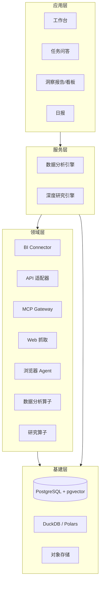
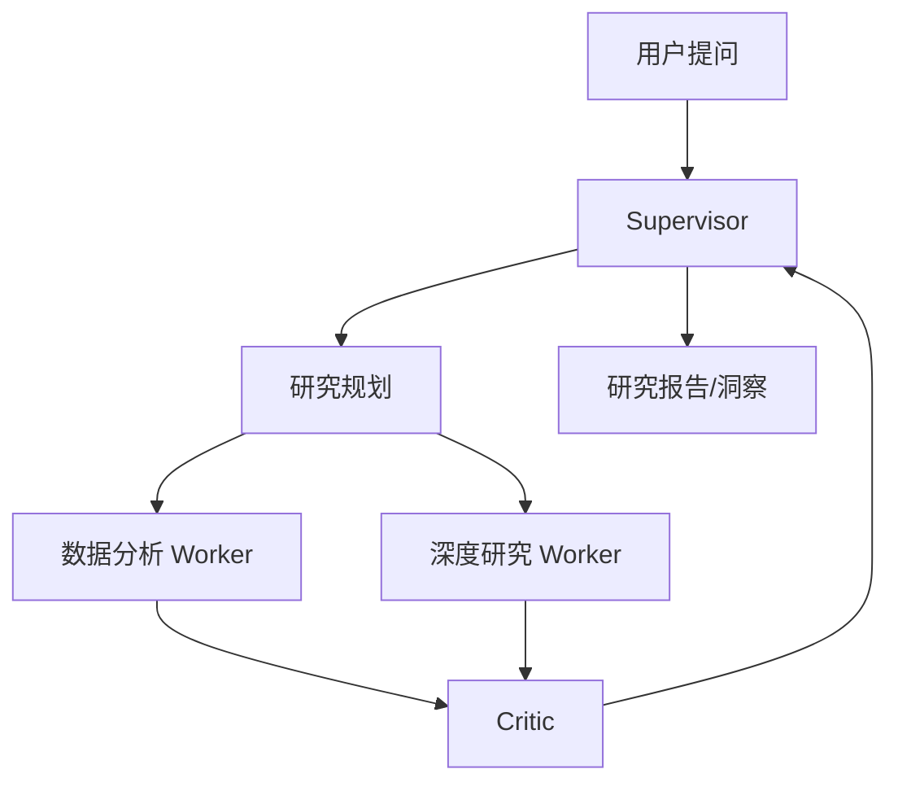
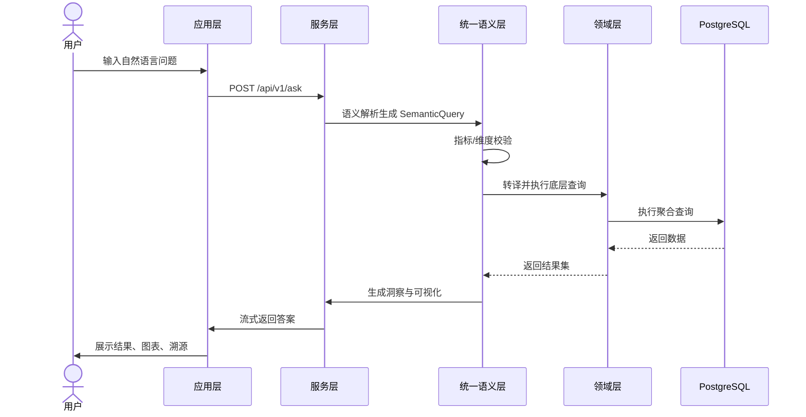
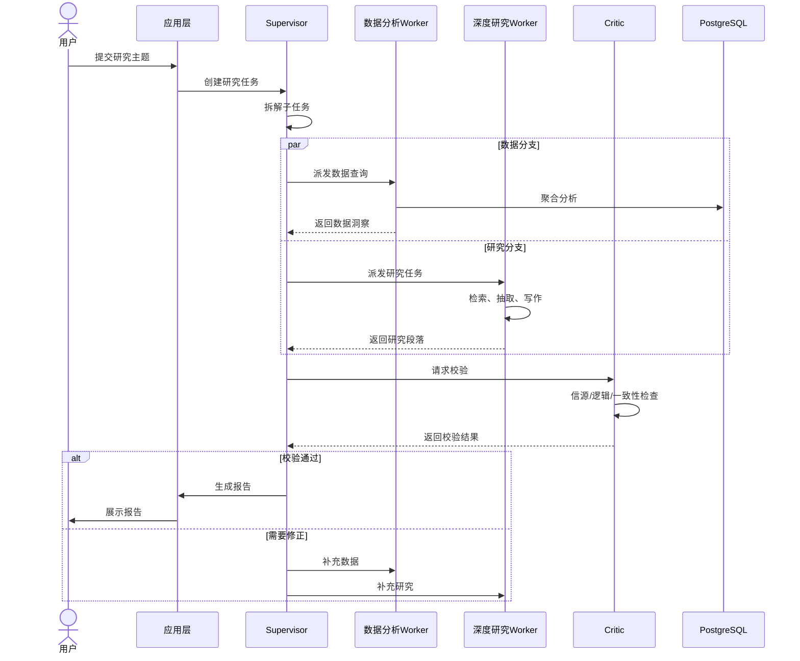
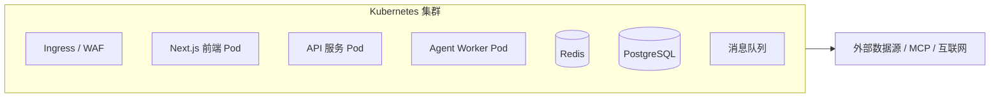

# 归因模块详细设计

## 1. 引言

### 1.1 项目背景

随着企业内部数据源持续扩张，业务人员在进行日常经营分析、市场研究、竞品跟踪和战略决策时，需要频繁穿梭于 BI 报表、业务系统、外部 API、公开互联网情报之间。信息获取成本高、口径不一致、分析过程难以复现、结论可信度难以评估，成为制约企业决策效率的主要瓶颈。

本系统定位为**企业内部生产力工具**，面向业务分析师、运营、产品、管理层等角色，提供一站式的数据接入、语义统一、自然语言问答、自动化洞察报告和深度研究能力。系统不是面向公众的 Demo，必须满足企业级的安全、合规、可审计、可运维、可扩展要求。

### 1.2 设计目标

| 目标 | 说明 |
|------|------|
| 统一语义入口 | 通过指标字典和血缘管理，将分散数据源抽象为业务可理解的统一语义层 |
| 自然语言交互 | 支持业务人员用自然语言提问，自动生成查询、分析和可视化 |
| 可信深度研究 | 通过多 Agent 协作与信源校验，生成可追溯、可验证的研究报告 |
| 企业级治理 | 内置 L0-L4 护栏、审计日志、FinOps 成本管控、权限隔离 |
| 可扩展集成 | 以 Adapter 和 Gateway 模式对接 BI、业务 API、MCP 服务、外部网站 |

### 1.3 设计约束

- 所有 AI 模型调用必须经过统一模型网关，便于后续接入代理、审计和配额管理
- 所有外部输入必须经过 Zod Schema 校验
- 数据层以 PostgreSQL + pgvector 为主存储，复杂分析场景下沉到 DuckDB/Polars
- 前后端采用 Next.js 全栈方案，严格区分服务端组件与客户端组件
- 代码组织采用 ESM Only，TypeScript 开启严格模式

---

## 2. 总体架构

### 2.1 架构分层

系统采用四层架构：

```
┌─────────────────────────────────────────────────────────────┐
│ 应用层（Application）                                        │
│ 工作台 / 任务问答 / 洞察报告 / 看板 / 日报                    │
│ Next.js 16 + React 19 + TypeScript + Tailwind CSS 4         │
├─────────────────────────────────────────────────────────────┤
│ 服务层（Service）                                            │
│ 数据分析域：数据管道 / 语义统一 / 指标建模 / 数据聚合          │
│ 深度研究域：研究规划 / 多 Agent 协同 / 评估验证                │
│ LangGraph + LangChain + Prompt Engineering                   │
├─────────────────────────────────────────────────────────────┤
│ 领域层（Domain）                                             │
│ 数据接入：BI Connector / API 适配 / MCP 网关 / Web 抓取        │
│ 浏览器模拟 / 数据分析算子 / 研究算子                           │
├─────────────────────────────────────────────────────────────┤
│ 基建层（Foundation）                                         │
│ PostgreSQL + pgvector / DuckDB / 对象存储 / 缓存 / 消息队列    │
└─────────────────────────────────────────────────────────────┘
```

### 2.2 核心组件关系



---

## 3. 应用层详细设计

### 3.1 功能模块

| 模块 | 功能描述 | 目标用户 |
|------|----------|----------|
| 工作台 | 个人待办、最近提问、收藏报告、快捷入口 | 全量用户 |
| 任务问答 | 自然语言提问，支持多轮追问、数据源选择、结果解释 | 业务分析师、运营 |
| 洞察报告 | 基于模板或自定义主题生成可交互报告 | 管理层、分析师 |
| 看板 | 关键指标监控、下钻分析、异常告警 | 运营、管理层 |
| 日报 | 定时生成数据摘要，推送至 IM / 邮件 | 管理层、团队负责人 |

### 3.2 技术栈

| 层级 | 技术选型 | 版本/说明 |
|------|----------|-----------|
| 框架 | Next.js | 16.3.2 |
| 运行时 | React | 19.2.8 |
| 语言 | TypeScript | 5.x，严格模式 |
| 样式 | Tailwind CSS | v4，通过 `@tailwindcss/postcss` 集成 |
| 组件库 | Radix UI  | |
| 状态管理 | Zustand | 客户端全局状态 |
| 数据获取 | SWR | 服务端状态与缓存 |
| 图表 | ECharts / Recharts | 可视化与看板 |
| 拖拽 | @dnd-kit | 工作台卡片编排 |
| 拖拽/排序 | @dnd-kit/sortable | 看板布局 |

### 3.3 页面结构

```
app/
├── (dashboard)/
│   ├── page.tsx                 # 工作台首页
│   ├── ask/
│   │   └── page.tsx             # 任务问答
│   ├── reports/
│   │   ├── page.tsx             # 洞察报告列表
│   │   └── [id]/
│   │       └── page.tsx         # 报告详情
│   ├── boards/
│   │   ├── page.tsx             # 看板列表
│   │   └── [id]/
│   │       └── page.tsx         # 看板详情
│   └── digests/
│       └── page.tsx             # 日报中心
├── api/
│   └── v1/
│       ├── ask/route.ts         # 问答接口
│       ├── reports/route.ts     # 报告接口
│       ├── boards/route.ts      # 看板接口
│       └── digests/route.ts     # 日报接口
├── login/page.tsx               # 登录页
└── layout.tsx                   # 根布局
```

### 3.4 服务端组件与客户端组件边界

- **服务端组件**：页面骨架、数据列表首屏、权限校验、元数据
- **客户端组件**：交互式图表、富文本编辑器、拖拽布局、流式回答展示、表单控件

客户端组件必须显式声明 `"use client"`，并使用 CSS Modules 进行样式隔离。

### 3.5 关键交互设计

#### 任务问答

1. 用户在输入框用自然语言描述问题
2. 系统实时识别意图并推荐相关指标/数据源
3. 用户确认或补充上下文后提交
4. 系统流式返回：理解 → 查询 → 分析 → 结论 → 可视化
5. 用户可追问、下钻、导出、收藏

#### 洞察报告

1. 用户选择报告模板（经营分析、竞品监控、用户增长等）
2. 配置时间范围、维度、数据源
3. 系统自动编排研究任务
4. 多 Agent 协同采集、分析、校验
5. 生成可编辑报告，支持版本管理和评论

#### 看板

1. 用户从问答或报告中添加卡片到看板
2. 支持拖拽布局、条件格式、阈值告警
3. 看板可订阅，定时刷新或推送

---

## 4. 服务层详细设计

服务层包含两大核心域：**数据分析域**与**深度研究域**。两者共享统一语义层和任务编排能力，但在执行路径上有所区分。

### 4.1 统一语义层

统一语义层是连接底层异构数据源与上层业务语义的核心抽象。

#### 4.1.1 核心职责

- **OSI 兼容**：Open Semantic Interoperability，支持指标、维度、计算的跨源对齐
- **指标字典**：集中管理指标定义、计算公式、业务口径、责任人
- **血缘追踪**：记录从原始数据到最终报告的全链路血缘

#### 4.1.2 核心实体

| 实体 | 说明 |
|------|------|
| Metric | 指标定义，包含名称、公式、单位、口径、版本 |
| Dimension | 维度定义，支持层级（省-市-区）和自定义分组 |
| SemanticModel | 语义模型，将物理表/视图映射为业务实体 |
| LineageNode | 血缘节点，记录数据转换链路 |
| MetricCatalog | 指标目录，按业务域组织 |

#### 4.1.3 查询语义转译

自然语言问题进入系统后，首先由 LLM 进行语义解析，生成结构化的 `SemanticQuery`：

```typescript
interface SemanticQueryV1 {
  intent: "query" | "compare" | "trend" | "breakdown" | "anomaly" | "forecast";
  metrics: Array<{ metricId: string; alias?: string }>;
  dimensions: Array<{ dimensionId: string; granularity?: string }>;
  filters: Array<{ field: string; operator: string; value: unknown }>;
  timeRange: { from: string; to: string; granularity?: string };
  sort?: Array<{ field: string; direction: "asc" | "desc" }>;
  limit?: number;
}
```

`SemanticQuery` 经过校验后，由对应适配器转译为底层查询：

| 数据源类型 | 转译目标 |
|-----------|----------|
| PostgreSQL 视图 | SQL |
| DuckDB | SQL |
| BI 数仓 | 数仓方言 SQL 或 MDX |
| GraphQL API | GraphQL Query |
| REST API | 内部查询请求 |

### 4.2 数据分析域

#### 4.2.1 数据管道/清洗

负责将接入层原始数据转换为可分析的结构化数据。

| 能力 | 说明 |
|------|------|
| 增量同步 | 基于 CDC 或时间戳的增量抽取 |
| 数据清洗 | 缺失值处理、格式标准化、去重 |
|  schema 适配 | 将异构 schema 映射为语义模型 |
| 质量校验 | 字段完整性、值域检查、波动性告警 |

#### 4.2.2 指标建模

基于语义层定义，构建指标计算逻辑。

- 原子指标：直接从数据源计算
- 派生指标：基于原子指标组合
- 复合指标：涉及跨源计算
- 时间智能指标：同比、环比、YTD、滚动窗口

#### 4.2.3 数据聚合

将语义查询转译为聚合查询并执行。

| 场景 | 执行引擎 |
|------|----------|
| 单源聚合 | PostgreSQL 或 DuckDB |
| 跨源聚合 | DuckDB / Polars 内存计算 |
| 大规模聚合 | Flink 流批一体（预留） |
| 自然语言聚合 | NL2SQL + 语义校验 |

### 4.3 深度研究域

深度研究域负责处理开放性、探索性问题，通过多 Agent 协作完成信息收集、分析、验证和报告生成。

#### 4.3.1 Agent 编排



| Agent | 职责 |
|-------|------|
| Supervisor | 接收用户问题，拆解任务，调度子 Agent，管理状态机 |
| 数据分析 Worker | 调用聚合引擎，获取结构化数据，生成数据洞察 |
| 深度研究 Worker | 进行信息检索、文献综述、竞品分析、趋势推演 |
| Critic | 校验信源可信度、逻辑一致性、数据与结论的一致性 |

#### 4.3.2 工作流状态机

```typescript
type ResearchState =
  | "queued"
  | "planning"
  | "collecting"
  | "analyzing"
  | "verifying"
  | "writing"
  | "reviewing"
  | "completed"
  | "failed";
```

每个状态变更均持久化到数据库，支持任务中断恢复和审计追溯。

#### 4.3.3 提示词工程

| 提示词类型 | 作用 |
|-----------|------|
| 系统提示词 | 定义 Agent 角色、边界、输出规范、安全约束 |
| 任务提示词 | 按场景模板化，如经营分析、竞品研究、用户洞察 |
| 校验提示词 | 引导 Critic 评估信源、逻辑、数据一致性 |
| 安全前缀 | 注入到自定义提示词前，防止越权或有害输出 |

---

## 5. 领域层详细设计

领域层封装与外部系统和计算引擎的交互细节。

### 5.1 数据接入

#### 5.1.1 BI Connector

| 项 | 说明 |
|----|------|
| 用途 | 连接内部 BI 平台、数仓 |
| 实现 | PostgreSQL 视图、JDBC/ODBC 代理、BI 开放 API |
| 安全 | 只读账号、列级权限、查询超时、结果集大小限制 |

#### 5.1.2 API 适配器

| 项 | 说明 |
|----|------|
| 用途 | 对接内部业务系统 REST/GraphQL API |
| 实现 | GraphQL 网关、REST 适配器模板 |
| 能力 | 限流、熔断、幂等、缓存、密钥托管 |

#### 5.1.3 MCP Gateway

| 项 | 说明 |
|----|------|
| 用途 | 接入外部 MCP（Model Context Protocol）服务 |
| 实现 | 基于 `mcp-gateway-oss` 构建 |
| 认证 | OAuth2.1，支持企业 SSO |
| 治理 | 调用审计、配额管理、能力白名单 |

#### 5.1.4 Web 抓取

| 项 | 说明 |
|----|------|
| 用途 | 公开互联网情报采集 |
| 实现 | Firecrawl + 自研解析器 |
| 约束 | 遵守 robots.txt、站点频率限制、敏感站点黑名单 |

#### 5.1.5 浏览器 Agent

| 项 | 说明 |
|----|------|
| 用途 | 模拟登录外部管理系统、处理动态页面 |
| 实现 | Playwright + 沙箱环境 |
| 安全 | 凭证托管于 Vault，会话隔离，操作录屏审计 |

### 5.2 算子层

#### 5.2.1 数据分析算子

| 算子 | 说明 |
|------|------|
| AggregateOp | 分组聚合、多维度下钻 |
| JoinOp | 跨源数据关联 |
| FilterOp | 条件过滤 |
| TransformOp | 数据转换、单位换算 |
| TimeSeriesOp | 时序补全、同比环比 |
| AnomalyOp | 异常检测 |

执行引擎：DuckDB（大规模内存分析）、Polars（高性能 DataFrame）。

#### 5.2.2 研究算子

| 算子 | 说明 |
|------|------|
| SearchOp | 多源检索（内部知识库 + 互联网） |
| ExtractOp | 关键信息抽取 |
| SummarizeOp | 内容摘要 |
| CompareOp | 多源对比 |
| CitationOp | 引用溯源 |
| WriteOp | 报告段落生成 |

---

## 6. 数据架构

### 6.1 主存储

| 数据库 | 用途 |
|--------|------|
| PostgreSQL | 业务数据、用户数据、任务状态、审计日志 |
| pgvector | 向量化存储文档片段、指标语义、研究素材 |

### 6.2 分析存储

| 引擎 | 用途 |
|------|------|
| DuckDB | 离线分析、跨源聚合、大规模 CSV/Parquet 处理 |
| Polars | 高并发内存计算、流式数据处理 |

### 6.3 缓存与消息

| 组件 | 用途 |
|------|------|
| Redis | 会话缓存、限流、任务状态锁 |
| 消息队列 | 异步任务调度、事件驱动、研究任务队列 |

### 6.4 核心数据模型

#### 6.4.1 用户与权限

```typescript
interface UserV1 {
  id: string;           // user_xxx
  email: string;
  name: string;
  departmentId: string;
  role: "admin" | "analyst" | "operator" | "viewer";
  createdAt: string;
}

interface WorkspaceV1 {
  id: string;           // workspace_xxx
  name: string;
  ownerId: string;
  dataSourceIds: string[];
}

interface PermissionV1 {
  subjectType: "user" | "role" | "workspace";
  subjectId: string;
  resourceType: "data_source" | "metric" | "report" | "board";
  resourceId: string;
  action: "read" | "write" | "admin";
}
```

#### 6.4.2 语义层

```typescript
interface MetricV1 {
  id: string;           // metric_xxx
  name: string;
  description: string;
  formula: string;
  unit?: string;
  ownerId: string;
  status: "draft" | "published" | "deprecated";
  version: number;
}

interface DataSourceV1 {
  id: string;           // data_source_xxx
  name: string;
  type: "bi" | "api" | "mcp" | "web" | "browser";
  config: Record<string, unknown>;
  connectorId: string;
}

interface SemanticModelV1 {
  id: string;           // semantic_model_xxx
  name: string;
  dataSourceId: string;
  tableRef: string;
  fields: Array<{ name: string; type: string; metricId?: string; dimensionId?: string }>;
}
```

#### 6.4.3 任务与报告

```typescript
interface QuestionV1 {
  id: string;           // question_xxx
  userId: string;
  workspaceId: string;
  content: string;
  context?: unknown;
  status: ResearchState;
  answer?: unknown;
  createdAt: string;
}

interface ResearchTaskV1 {
  id: string;           // task_xxx
  questionId: string;
  parentTaskId?: string;
  agentType: "supervisor" | "data_analyst" | "researcher" | "critic";
  status: ResearchState;
  input: unknown;
  output?: unknown;
  citations?: CitationV1[];
  startedAt?: string;
  completedAt?: string;
}

interface ReportV1 {
  id: string;           // report_xxx
  title: string;
  templateId?: string;
  content: unknown;
  citations: CitationV1[];
  status: "draft" | "published" | "archived";
  createdBy: string;
  createdAt: string;
}
```

---

## 7. 核心业务流程

### 7.1 自然语言问答流程



### 7.2 深度研究流程



---

## 8. 安全与治理

### 8.1 护栏体系（L0-L4）

| 层级 | 名称 | 职责 |
|------|------|------|
| L0 | 输入护栏 | 输入校验、敏感信息检测、注入防护 |
| L1 | 语义护栏 | 指标口径校验、越权查询拦截 |
| L2 | 模型护栏 | 输出安全过滤、幻觉检测、隐私保护 |
| L3 | 业务护栏 | 审批流、高风险操作二次确认 |
| L4 | 审计护栏 | 全链路日志、合规审计、追溯回放 |

### 8.2 权限模型

采用 RBAC + ABAC 混合模型：

- RBAC：角色定义基础权限集合
- ABAC：基于部门、数据源、指标维度等属性进行细粒度控制

### 8.3 审计与合规

- 所有用户操作、Agent 调用、数据访问记录审计日志
- 支持按用户、时间、资源类型检索
- 保留策略符合企业内部合规要求

### 8.4 FinOps

- 模型调用按 Workspace / 用户维度计量
- 数据源调用按次数和流量计费
- 支持预算告警、成本分摊报表

---

## 9. 非功能性需求

| 维度 | 目标 | 措施 |
|------|------|------|
| 可用性 | 99.9% SLA | 多实例部署、健康检查、自动恢复 |
| 性能 | 简单问答 < 3s，复杂研究 < 60s | 缓存、异步任务、查询优化 |
| 扩展性 | 支持新数据源快速接入 | Adapter 模式、插件化连接器 |
| 安全性 | 企业级安全基线 | 护栏、加密、审计、最小权限 |
| 可观测性 | 全链路可追踪 | OpenTelemetry、结构化日志、告警 |
| 可维护性 | 代码可测试、可部署 | 单元测试、E2E 测试、CI/CD |

---

## 10. 部署与运维

### 10.1 部署架构



### 10.2 关键脚本

| 脚本 | 用途 |
|------|------|
| `npm run local:up` | 本地启动完整环境 |
| `npm run db:generate` | 生成数据库迁移 |
| `npm run typecheck` | TypeScript 类型检查 |
| `npm run lint` | ESLint 代码检查 |
| `npm run i18n:check` | 国际化覆盖检查 |
| `npm test` | 运行测试套件 |

### 10.3 可观测性

- **指标**：Prometheus + Grafana
- **日志**：结构化 JSON 日志，统一收集
- **追踪**：OpenTelemetry 全链路追踪
- **告警**：基于 SLI/SLO 配置告警规则

---

## 11. 技术选型汇总

| 领域 | 选型 | 版本/备注 |
|------|------|-----------|
| 前端框架 | Next.js | 16.3.2 |
| UI 库 | React | 19.2.8 |
| 语言 | TypeScript | 5.x，严格模式 |
| 样式 | Tailwind CSS | v4 |
| 组件库 | Radix UI| 内部 UI 库 |
| ORM | Prisma | 以 Prisma  |
| 验证 | Zod | 所有外部输入校验 |
| AI 编排 | LangGraph + LangChain | Agent 工作流 |
| 主数据库 | PostgreSQL | 业务数据与审计 |
| 向量库 | pgvector | 语义检索 |
| 分析引擎 | DuckDB / Polars | 高性能分析 |
| 浏览器模拟 | Playwright | 动态页面采集 |
| Web 抓取 | Firecrawl | 结构化抓取 |
| MCP 网关 | mcp-gateway-oss | 外部能力接入 |

---

## 12. 设计原则与规范

1. **统一模型边界**：所有 AI 调用经过模型网关，便于审计、配额和代理接入
2. **Adapter 可替换**：数据源、身份、对象存储通过 Adapter 模式支持多后端
3. **Schema 优先**：所有外部输入使用 Zod 校验，类型从 Schema 推断
4. **安全默认**：响应附加安全头、跨站请求验证、Origin 检查
5. **ESM Only**：项目使用 `"type": "module"`，全部代码采用 ESM
6. **可观测内建**：每个关键操作都记录日志、指标和追踪
