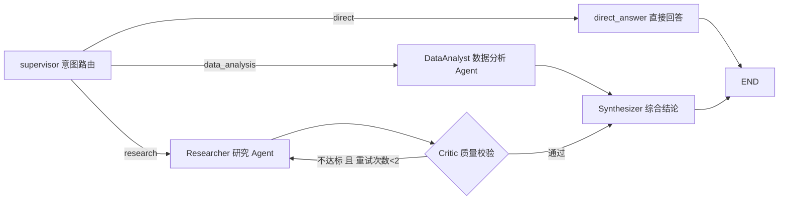

# pt-ai-acquisition-cause 技术实现详解（汇报版）

> 更新：2026-08-26 ｜ 目的：面向上级的实现细节汇报材料
> 范围：任务问答 Agent 编排、数据分析（算子 + 语义统一）、深度研究（算子 + 关键 Prompt）

---

## 一、总体架构与技术栈

| 层级 | 选型 | 说明 |
|---|---|---|
| 前端 | Next.js 16 + React 19 + Tailwind CSS 4 + Recharts + tldraw | 问答/研究/画布/算子中心等 7 个页面 |
| Agent 框架 | LangChain + LangGraph（StateGraph / createReactAgent） | 多 Agent 编排与 ReAct 工具循环 |
| 模型接入 | 统一模型网关（OpenAI 协议，主备自动降级） | 所有 LLM 调用经同一出口 |
| 数据库 | PostgreSQL + Prisma 7 | 平台库 + 演示数据库（data schema） |
| 实时输出 | SSE（Server-Sent Events）统一事件协议 | Agent 每一步动作实时推送前端 |
| 校验 | Zod | API 入参、算子入参、语义查询结构全部强校验 |

后端核心分层（`lib/server/`）：

```
agents/       → Supervisor 编排 + Worker Agent + 深度研究工作流 + 事件协议
semantic/     → 统一语义层（模型定义 + NL2SQL 转译）
operators/    → 算子层（6 个数据分析算子 + 6 个研究算子）
connectors/   → 数据连接器（PostgreSQL / REST·GraphQL / MCP / Web 搜索抓取）
delivery/     → 报告投递（邮件 / 图片导出）
```

### 1.1 统一模型网关（model-gateway.ts）

- 所有 AI 调用（路由、分析、研究、综合、算子内 LLM）**必须经过同一网关**，便于统一管控与切换模型。
- **主备自动降级**：主网关 401/5xx/超时/网络异常时熔断，5 分钟冷却期内自动走备用网关；流式与非流式均支持降级。
- **reasoning 模型兼容**：对先输出思考过程的模型，content 为空时自动加倍 max_tokens 重试。
- 对外两类出口：OpenAI SDK 原生 `chatCompletion/chatCompletionStream`；LangChain `ChatOpenAI` 工厂（供 LangGraph Agent 工具调用）。

### 1.2 Agent 事件协议（events.ts）

问答与研究接口通过 SSE 逐事件推送统一契约：

```
meta → phase → plan → step → tool_call/tool_result → table/chart → citations → chunk → done
```

前端因此能**完整回放 Agent 的每一步**：路由决策、执行了哪些 SQL、生成了哪些图表、搜索了什么关键词、抓取了哪些网页、记录了哪些发现。全链路透出是系统"可信、可解释"的基础。

---

## 二、任务问答（/ask）：多 Agent 编排实现

### 2.1 技术选型

- 编排引擎：**LangGraph StateGraph**（有向图 + 条件边 + 状态归约）
- Worker：**LangGraph createReactAgent**（ReAct 工具循环）
- 入口：`POST /api/v1/ask` → SSE 流式返回，结果持久化（含图表/表格/SQL/引用/Critic 评分），支持 `parentQuestionId` 多轮追问（沿父问答链回溯最多 4 轮构建对话历史）

### 2.2 工作流拓扑（supervisor.ts）



- **Supervisor**：一次 LLM 调用完成意图三分类（data_analysis / research / direct），temperature=0，仅输出 JSON。
- **Critic 回路**：研究产出先过硬校验（≥2 条发现且 ≥1 个信源），再走 LLM 软校验（覆盖度 40% / 信源质量 30% / 具体性 30%，≥6 分通过）；不达标带 issues 重启研究一次，最多两轮，防止无限循环。
- **Synthesizer**：汇聚数据分析 Agent 总结 + **原始查询结果表**（防转述失真，声明"数值以原始表为准"）+ 执行过的 SQL + 研究证据池 + 引用来源 + Critic 评分，流式生成最终结构化回答。
- 全程事件经 `ctx.sink` 实时推送；完成后将 Agent 轨迹写入 `research_tasks` 表（supervisor / worker / critic 各一条），可审计。

### 2.3 关键 Prompt ①：意图路由（Supervisor）

```text
你是归因模块的任务路由器（Supervisor）。判断用户问题应走哪条处理路径：

- research（深度研究）：回答需要最新的外部互联网信息、行业公开情报。特征：行业趋势、
  市场规模、竞争格局、竞品动态、政策法规、技术进展……只要问题涉及真实世界的具体行业、
  市场、公司、产品、技术的外部信息，就必须选 research
- data_analysis（数据分析）：问题需要查询/统计/对比内部经营数据才能回答。特征：提到
  GMV、订单、用户、转化率、区域、渠道、同比、环比、异常、原因分析等内部指标词汇
- direct（直接回答）：通用知识概念解释、方法论咨询、平台使用帮助、闲聊

判断优先级：涉及外部行业/市场/公司信息 → research；涉及内部经营指标 → data_analysis；
纯知识问答 → direct。若问题同时涉及内部数据和外部信息，优先 data_analysis。

示例：
- "2026年各大区GMV多少？为什么华东下滑？" → {"route": "data_analysis"}
- "竞品最近有什么新动作？" → {"route": "research"}
- "什么是RFM模型？怎么用？" → {"route": "direct"}

仅输出 JSON：{"route": "data_analysis|research|direct", "reason": "一句话理由"}
```

设计要点：**明确的判定特征词表 + 优先级规则 + few-shot 示例 + 强制 JSON 输出**，把路由错误率压到最低；解析侧还有三级 JSON 提取兜底（直接解析 → 代码块提取 → 花括号提取）。

### 2.4 关键 Prompt ②：综合结论（Synthesizer）

```text
你是归因模块的首席分析师（Synthesizer）。下属 Agent 已完成工作，请基于其产出撰写
面向业务用户的最终回答。

要求：
1. 结论先行：第一段直接给出核心结论（1-3 句加粗要点）
2. 数据支撑：引用具体数值（来自 Agent 产出，禁止编造或修改）
3. 结构化：用 Markdown 标题/列表组织；图表已由前端展示，无需重复绘制数据
4. 归因与建议：数据类问题给出归因分析与行动建议；研究类问题注明证据强度
5. 引用标注：研究结论后标注来源编号如 [1][2]
6. 诚实边界：证据不足处明确说明（"基于现有数据/信源..."）
7. 中文回答，长度与问题复杂度匹配
```

配合机制：上下文里同时塞入 **Agent 总结 + 原始查询表格数据**，并声明"与上文冲突时以原始表为准"——从机制上防止 LLM 转述数值失真。

---

## 三、数据分析：ReAct Agent + 算子 + 语义统一

### 3.1 DataAnalyst Agent（ReAct 工具循环）

被路由命中后，`createReactAgent` 挂载 4 个工具自主循环（通常 2-5 轮查询）：

| 工具 | 能力 | 安全护栏 |
|---|---|---|
| `sql_query` | 对 data schema 执行只读 SQL | **仅允许单条 SELECT/WITH**；statement_timeout 20s；最多 300 行；结果自动注册为前端表格 |
| `inspect_schema` | 内省库表结构（列名/类型） | 防止模型瞎猜列名 |
| `show_table` | 主动展示结构化表格 | ≤100 行 |
| `generate_chart` | 生成 ChartSpec（bar/line/area/pie/radar），前端 Recharts 渲染 | ≤200 数据点 |

工具描述即**数据字典**：`sql_query` 的 description 里完整枚举了 5 张表的全部字段与业务含义（如 `fd_users=首次充钱、rd_users=召回再充钱、ad_channel 取值 Meta/X/TikTok`），该字典由语义层模型定义自动生成（`demoTablesHint()`），保证模型写 SQL 时口径与语义层一致。

### 3.2 关键 Prompt ③：数据分析 Agent（DATA_ANALYST_PROMPT）

```text
你是归因模块的数据分析 Agent（DataAnalystWorker）。

## 你的能力
- sql_query / inspect_schema / show_table / generate_chart

## 数据字典
${demoTablesHint()}   ← 由统一语义层自动生成

## 工作规范（必须遵守）
1. 先看结构再查询：不熟悉列名时先用 inspect_schema 确认，禁止瞎猜列名
2. 多步验证：复杂问题拆成多轮查询（先总览 → 再下钻 → 再对比），通常 2-5 次查询
3. 数值严谨：GMV/金额保留 2 位小数；转化率注意是比率（0-1）需乘 100 显示为百分比
4. 主动可视化：趋势用 line/area，分类对比用 bar，占比用 pie——每次任务至少 1 张图
5. 同比环比：涉及"同比/环比/变化"时用窗口函数（LAG 或日期自联结）计算
6. 异常归因：涉及"为什么/原因"时，按维度逐层下钻定位（总体 → 区域 → 渠道 → 日期）
7. 最终回答：中文，结构为「结论 → 关键数据 → 归因分析 → 建议」，数值必须来自查询结果，禁止编造
```

设计要点：把**分析方法论写成硬性工作规范**（先查结构、多步下钻、窗口函数算同环比、强制可视化、禁止编造），让 ReAct 循环行为稳定可预期。

### 3.3 统一语义层（semantic-query.ts / model-store.ts）

语义层是全平台的**指标口径统一中枢**，链路对应：

```
自然语言问题 → LLM 语义解析为 SemanticQueryV1（结构化查询意图）
            → 白名单校验（指标/维度必须注册）
            → translateToSql 转译为 PostgreSQL SQL
            → 只读执行 → 结果集
```

关键设计：

1. **结构化查询意图 SemanticQueryV1**（Zod Schema）：`intent`（query/compare/trend/breakdown/anomaly/forecast）+ metrics + dimensions（含时间粒度 day/week/month/quarter/year）+ filters（9 种操作符）+ timeRange + sort + limit。自然语言不直接变 SQL，中间隔一层强类型结构，**可校验、可审计**。
2. **语义模型 = 物理表的业务视图**：每张表定义指标（物理列 + 聚合方式 sum/avg/count + 单位 + 口径描述）与维度（物理列 + 枚举取值）。当前 5 个内置模型：经营日指标、订单明细、商品维表、**投放渠道日指标**（Meta/X/TikTok × app/web × 5 市场，FD/RD 全漏斗）、**投放计划**。
3. **内置 + 自定义双轨**：内置模型只读；自定义模型持久化于 `cause.semantic_models` 表，经 REST CRUD 管理，可挂载到已注册的 BI 数据源。表/列名经 IDENT_PATTERN 白名单校验防 SQL 注入，字符串值统一转义。
4. **SQL 转译器 translateToSql**：自动定位最优模型（指标命中权重 2、维度命中权重 1 打分）、时间粒度截断映射（to_char/date_trunc）、标准子句顺序 WHERE→GROUP BY→ORDER BY→LIMIT。试运行入口 `POST /api/v1/semantic/translate` 返回 SQL + 真实结果集，配置即验。
5. **语义层喂给 Agent**：数据分析 Agent 的数据字典、图表/分析口径全部源自语义模型定义，保证"人配置的口径"与"AI 查询的口径"是同一套。

### 3.4 算子层：数据分析算子（data-operators.ts + registry.ts）

算子 = **元数据（名称/参数 Schema）+ Zod 输入校验 + 纯执行函数**，统一注册于 registry，经 `GET /api/v1/operators`（列表，参数 Schema 供前端动态渲染表单）与 `POST /api/v1/operators/run`（真实试运行，返回 SQL + 结果 + 耗时）暴露，构成"算子中心"页面。

6 个数据分析算子（全部 SQL 引擎真实执行）：

| 算子 | 能力 | 实现亮点 |
|---|---|---|
| `aggregate` 分组聚合 | 按区域/渠道/类目/状态聚合 6 类指标，支持日期范围 | 指标→聚合表达式映射表，自动生成 GROUP BY |
| `timeseries` 时序分析 | 按日/周/月聚合并**自动算环比 MoM 与同比 YoY** | 窗口函数 `LAG(1)` / `LAG(12)` 计算变化率 |
| `anomaly` 异常检测 | 时序异常点检测，按异常程度排序输出 | **28 天滑动窗口 Z-Score**（\|z\|>阈值判异常），纯 SQL 窗口函数实现 |
| `filter` 条件过滤 | 区域/渠道/日期下钻明细 | 参数转义后拼 WHERE |
| `transform` 数据转换 | 单位换算与派生指标（万元、百分比、客单价、退款率） | UNION ALL 跨表统一口径后聚合 |
| `join` 跨源关联 | 指标汇总表 × 订单明细关联，GMV 占比 vs 实际订单表现 | CTE + JOIN + 窗口函数算占比，附口径差异说明 |

算子的价值：**把常用分析动作沉淀为参数化、可复用、可试运行的原子能力**——既能在算子中心人工试运行验证，也为后续 Agent 自动编排提供标准化积木；每个算子返回真实执行的 SQL，天然可审计。

### 3.5 只读执行护栏（connectors/postgres.ts）

Agent 与算子生成的 SQL 统一走 `executeReadOnlyQuery`：

- **SELECT-only**：拒绝一切 DDL/DML；
- **statement_timeout 硬超时**（20-30s）+ 结果行数上限；
- 每目标库独立连接池（max=3），空闲 10 分钟自动回收。

---

## 四、深度研究：双形态实现 + 研究算子

深度研究有两条互补链路，共享同一套检索/抓取基础设施：

| 形态 | 入口 | 编排 | 定位 |
|---|---|---|---|
| 问答级研究 | `/ask` 路由命中 research | ReAct Agent + Critic 回路 | 快问快答式研究，结论直接进综合回答 |
| 深度研究任务 | `/research` 显式发起 | Planner → Executor → Synthesizer 状态机 | 正式研究报告，子问题可追踪、报告可回看 |

### 4.1 形态一：问答级 ReAct 研究（workers.ts）

ResearchWorker 由 `createReactAgent` 驱动，工具集：

| 工具 | 预算控制（工具层硬拦截） |
|---|---|
| `web_search` 互联网搜索 | **整任务最多 8 次**，超额直接返回"请立即 record_finding 并收尾" |
| `fetch_page` 网页正文深读 | **最多 6 页**，超额拦截 |
| `record_finding` 记录研究发现 | 无限次；发现进入最终证据池 |
| `query_api_source` / `query_mcp_source` | 按已注册外部数据源**动态启用**（最多 6 次 / 3 次） |

三重防失控机制：
1. **工具层预算硬拦截**：超预算返回强引导文本，逼模型转入记录阶段；
2. **Prompt 层工作节奏约束**：拆解→检索→深读→记录→收尾；
3. **系统兜底**：若模型没调用 record_finding，系统自动把搜索摘要"转正"为研究发现（带来源编号），保证 Critic/Synthesizer 有证据可用；研究中断/递归超限时同样兜底保留已有证据。

#### 关键 Prompt ④：研究 Agent（RESEARCHER_PROMPT）

```text
你是归因模块的深度研究 Agent（ResearchWorker）。

## 你的能力（及预算）
- web_search：互联网搜索，整个任务最多 8 次（工具会强制拦截超额调用）
- fetch_page：抓取网页正文深读，整个任务最多 6 页
- record_finding：记录重要发现（进入最终报告证据池）

## 工作节奏（必须遵守，防止无限检索）
1. 拆解：把研究问题拆成 2-3 个子问题
2. 检索：每个子问题搜索 1-2 次（总共 ≤6 次），关键词精炼（避免整句搜索）
3. 深读：对最相关的 2-3 个结果用 fetch_page 获取全文，提取具体数据
4. 记录：每完成一个子问题，立即用 record_finding 记录 1-2 条发现
   （必须含数据/事实 + 来源编号 [n]）——这是最重要的产出，不要只搜不记
5. 收尾：发现数 ≥3 条后停止检索，输出最终回答

## 判断规则
- 搜索结果摘要已含答案的就不用再 fetch_page
- 连续 2 次搜索都无高相关结果 → 换子问题，不要死磕同一角度
- 时间预算紧张时（已搜索 ≥5 次）：直接基于已有摘要 record_finding，然后收尾

## 信源意识
- 优先权威来源（政府/机构报告、主流媒体、官方数据）；对营销内容保持怀疑

记住：record_finding 的产出决定任务成败，未记录发现的研究等于没有研究。
```

#### 关键 Prompt ⑤：Critic 质量校验

```text
你是研究质量评审（Critic）。输出 JSON：{"score": 0-10, "passed": true/false, "issues": [...]}
评分标准：
- 覆盖度：研究发现是否回应了研究问题的各个子方面（权重 40%）
- 信源质量：引用来源是否多样且相关（权重 30%）
- 具体性：发现是否含具体数据/事实而非泛泛而谈（权重 30%）
passed = score >= 6
```

先硬校验（<2 条发现或无信源直接不通过，省去 LLM 调用），再 LLM 软校验；不通过则把 issues 注入下一轮研究的用户消息（"Critic 反馈：上一轮未达标，本轮必须补足"），形成闭环。

### 4.2 形态二：深度研究任务状态机（deep-research.ts）

面向用户显式发起的研究任务，状态机 `planning → collecting → writing → completed/failed`，每阶段持久化到 `research_tasks`（主任务 + 每个子问题一条子任务，parentTaskId 关联），全程 SSE 透出。

**阶段 1 — Planner（研究规划）**：LLM 将研究问题拆解为 3-5 个子问题，每个子问题带 rationale 与 2-3 组检索关键词；拆解失败兜底为"直接研究原问题"。

```text
你是归因模块的研究规划 Agent（Planner）。将用户的研究问题拆解为一份可执行的研究计划。
1. objective：用一句话概括研究目标
2. subQuestions：3-5 个互相补充、覆盖问题主要方面的子问题（不重叠、不遗漏关键维度）
3. 每个子问题给出 rationale 与 2-3 组精炼的中文检索关键词
4. 拆解视角参考：市场格局 / 规模与增长 / 主要玩家与竞争 / 技术与产品 / 政策与风险 / 趋势预测
仅输出 JSON：{"objective": "...", "subQuestions": [{question, rationale, keywords}]}
```

**阶段 2 — Executor（逐子问题证据收集）**：每个子问题执行固定四步流水线——

1. **检索**：子问题本身 + Planner 关键词，最多 3 轮；结果 ≥4 条且已搜 2 轮即提前省额；
2. **证据池**：全部搜索摘要按 URL 去重入池，**CitationRegistry 全局去重分配引用编号 [n]**；
3. **深读**：对排名最靠前的 2 页（deep 模式 3 页）抓取正文替换摘要；
4. **证据抽取**：LLM 基于材料产出 2-4 条结构化发现（Extractor）。

```text
你是研究证据抽取 Agent。给定一个子问题与若干检索材料（含编号 [n]），抽取关键发现。
1. 产出 2-4 条发现，每条必须包含具体事实/数据（数字、时间、主体、动作），禁止泛泛而谈
2. 每条发现末尾标注来源编号，如 [1][3]；材料中没有的信息禁止编造
3. 材料不足以回答的部分，输出一条"证据缺口"说明
仅输出 JSON：{"findings": ["发现1 [1]", "发现2 [2][3]"]}
```

系统还会从发现文本中正则提取 `[n]` 编号，建立"子问题 ↔ 引用来源"的可追溯关系。

**阶段 3 — Synthesizer（报告生成）**：以全部子问题发现 + 引用清单为输入，流式生成固定结构的正式报告。

```text
你是归因模块的首席研究分析师（Synthesizer）。基于各子问题的研究发现撰写结构化研究报告。

报告结构（Markdown）：
# 研究报告
## 执行摘要（3-5 条加粗要点，直接回答研究目标，每条含关键数据）
## 详细发现（按子问题分小节，结论后标注引用编号 [n]）
## 综合分析（跨子问题的交叉洞察：趋势、矛盾点、确定性评估）
## 结论与展望（核心结论 3 条以内 + 后续值得跟踪的问题）
## 证据缺口（现有信源未覆盖的部分，诚实声明）

写作要求：
1. 所有事实性陈述必须来自研究发现，禁止编造数据
2. 数值引用保留原始口径（预测值注明预测机构与年份）
3. 中文，正式书面语，篇幅 800-1500 字
```

### 4.3 检索与抓取基础设施（connectors/web.ts）

- **搜索**：Bing HTML 结果解析为主源（cheerio 解析 `li.b_algo`），DuckDuckGo HTML 接口为备源，**双源均无需 API Key**；
- **抓取**：fetch + cheerio 去除 nav/footer/script/广告等噪声节点，按 article→main→content→body 顺序选最大正文容器，空白归一化，截断至预算字数；
- **安全**：SSRF 防护（正则拒绝 localhost/内网/链路本地地址）、进程内频率限制（最小间隔 600ms）、超时熔断（AbortController）；
- 预留 Firecrawl 扩展位（配置 Key 即启用）。

### 4.4 研究算子（research-operators.ts）

与数据算子同一套注册/校验/试运行机制，6 个研究算子构成标准研究流水线**"检索 → 抽取 → 摘要 → 对比 → 溯源 → 写作"**：

| 算子 | 引擎 | 能力 |
|---|---|---|
| `search` 多源检索 | 检索 | 对研究问题执行互联网搜索，返回结构化结果，流水线第一步 |
| `extract` 信息抽取 | hybrid | 抓取网页正文 + LLM 按关注要点抽取 ≤8 条要点（保留具体数据/时间） |
| `summarize` 内容摘要 | LLM | 多段素材压缩为"一句话结论 + 要点"或段落式摘要 |
| `compare` 多源对比 | LLM | 对比多信源观点：先共识、再分歧（源A认为…源B认为…）、最后综合判断 + 置信度 |
| `citation` 引用溯源 | 检索 | 搜索结果整理为规范引用列表（编号/标题/URL/脚注格式），可直接粘入报告 |
| `write` 报告写作 | LLM | 按章节 + 素材 + 目标受众（管理层/分析师/业务团队，不同写作侧重）生成 300-500 字 Markdown 段落，数据必须来自素材，无支撑判断标注"待验证" |

**算子与研究链路的关系**：深度研究状态机的三个阶段正是这些算子的编排组合（search/extract 对应 Executor 的检索与抽取，write 对应 Synthesizer 成稿）；算子层把同样的能力拆成独立、可单步试运行的原子单元，在算子中心供人工验证与复用，两条链路共享同一 web 连接器与模型网关。

---

## 五、端到端验证结果（实测）

以「对比 Meta、X、TikTok 三个投放渠道 2026 年以来的效果……哪个渠道性价比最高？」为例（`/ask` 全链路 134 秒）：

```
Supervisor        → 路由决策：data_analysis（问题涉及内部投放经营数据）
DataAnalyst       → SQL 1: 确认渠道列表（SELECT DISTINCT ad_channel）
                  → SQL 2: 按渠道聚合花费/下载/FD/RD/收入/ROI/CPI
                  → 图表 ×3: 花费收入对比、ROI 对比、成本效率对比（bar）
Synthesizer       → 流式生成结论（引用原始表数值）
```

Agent 结论：**Meta ROI 1.37 为唯一盈利渠道；TikTok 低成本拉新（CPI $1.22）但 ROI 仅 0.99；X 表现最差（ROI 0.19）**——与预埋数据洞察完全一致，证明 NL2SQL 口径、图表生成与结论综合全链路可信。

---

## 六、工程亮点小结（汇报要点）

1. **多 Agent 有向图编排**：LangGraph StateGraph 定义路由/分析/研究/评审/综合五类节点，条件边 + Critic 回路（最多重试 1 次）兼顾质量与成本。
2. **Prompt 工程体系化**：全部系统提示词集中于 `lib/server/agents/prompts.ts`（Prompt 中心，禁止散落），均锚定“流量投放效果归因”平台定位；遵循“角色 + 能力边界 + 硬性工作规范 + 输出格式约束”范式，且数值诚实性（禁止编造、原始表为准）写入每个产出环节；表/列口径不写死在提示词里，由统一语义层生成的数据字典动态注入。
3. **防失控三重保险**：工具层预算硬拦截（搜索 8 次/抓取 6 页）+ Prompt 层节奏约束 + 系统层证据兜底转正。
4. **语义统一**：指标口径定义一次（语义模型），NL2SQL 转译、Agent 数据字典、人工试运行三处同源；结构化查询意图 + 白名单校验 + 标识符净化，安全可审计。
5. **算子化沉淀**：12 个算子（6 数据 + 6 研究）= 元数据 + Zod Schema + 执行函数，注册表统一暴露，前端动态渲染参数表单，真实执行返回 SQL/耗时，既是能力积木也是审计凭据。
6. **全链路可观察**：SSE 事件协议覆盖每一次工具调用与产出；问答与研究结果连同 Agent 轨迹持久化，可回看、可追溯。
7. **可靠性设计**：模型网关主备熔断降级、SQL 只读护栏与超时、检索 SSRF 防护与频控、多级 JSON 解析兜底。

---

## 七、关键文件索引

| 模块 | 文件 |
|---|---|
| Prompt 中心 | `lib/server/agents/prompts.ts`（全部提示词统一管理） |
| 工作流编排 | `lib/server/agents/supervisor.ts` |
| Worker Agent | `lib/server/agents/workers.ts` |
| Agent 工具集 | `lib/server/agents/tools.ts` |
| 深度研究状态机 | `lib/server/agents/deep-research.ts` |
| 事件协议 | `lib/server/agents/events.ts` |
| 语义层 | `lib/server/semantic/semantic-query.ts`、`model-store.ts` |
| 数据算子 | `lib/server/operators/data-operators.ts` |
| 研究算子 | `lib/server/operators/research-operators.ts` |
| 算子注册表 | `lib/server/operators/registry.ts` |
| 模型网关 | `lib/server/model-gateway.ts` |
| 连接器 | `lib/server/connectors/postgres.ts`、`web.ts`、`api.ts`、`mcp.ts` |
| API 路由 | `app/api/v1/ask/route.ts`、`research/route.ts`、`operators/route.ts`、`semantic/translate/route.ts` |
