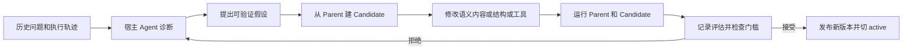
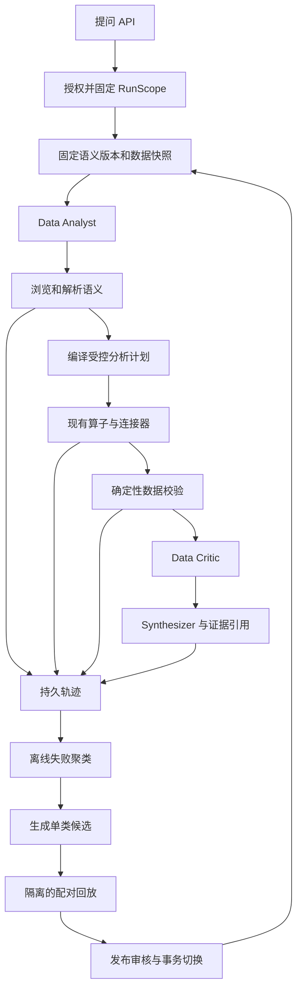

# EvoOntology 核查与归因 Agent 改进设计

## 1. 决策结论

**值得借鉴，建议在现有 TypeScript 系统内实现受控的语义层学习。先补查询正确性、指标契约和回放验证，再增加自动候选生成。**

EvoOntology 有实质实现。它把业务概念、数据映射、使用约束和证据保存为可查询的语义对象，再依据执行轨迹提出候选修改，通过评估后发布新版本。这可以减少重复找表、猜字段和重复踩口径问题的成本。

它的“自进化”发生在外部语义状态上。模型权重、归因算法和业务因果知识没有因此自动得到训练。诊断和编辑主要由 Claude Code、Codex 等宿主 Agent 按技能执行，Python 核心提供存储、状态和评估接口。默认触发器发出提醒。[E1][E2][E3]

你的项目已经有运行时语义模型、确定性算子和研究图谱。最有价值的改进是：让这些能力具有可执行口径、按需检索、版本固定、完整证据和评估后发布的机制。直接增加一个 Python MCP 服务，仍需解决相同的接入问题，还会增加运行和权限边界。

建议采用以下优先级：

| 优先级 | 工作 | 业务价值 |
|---|---|---|
| P0 | 修正数据源路由与聚合语义；贯穿用户、工作区和数据范围 | 防止查询成功但查错库、算错指标或读错范围 |
| P1 | 建指标契约、语义版本、确定性数据校验和细粒度轨迹 | 让结果可解释、可复算、可回放 |
| P2 | 增加按需语义检索、两期对比和贡献分解 | 减少探索成本，给“为什么变化”提供数值证据 |
| P3 | 从重复错误生成候选，离线配对验证，审核后发布 | 让系统积累经验，同时控制错误传播 |

现阶段不适合自动修改核心业务指标定义、SQL 执行代码或任意工具代码。一次成功查询和用户点赞，都不足以证明一个口径正确。

### 1.1 核查范围

- 核查日期：2026-10-08，时间口径为 Asia/Shanghai。
- 开源仓库：[ruc-datalab/EvoOntology](https://github.com/ruc-datalab/EvoOntology)。固定提交为 `f64413dae88d88645b1f2c069cf4e17308ad0f89`，提交日期为 2026-09-29。
- 论文：[arXiv:2609.15779v1](https://arxiv.org/html/2609.15779v1)，提交日期为 2026-09-14。
- 自研项目：`/Users/roryyu/Downloads/code/qoder-app/pt-ai-acquisition-cause`，读取时 HEAD 为 `cb61ab764062fdee81ebd692737b2eb74a2bf8e8`。现有未提交文档变更一并视为本地现状，源码事实以实际文件为准。
- 读取了核心源码、技能流程、基准适配器、测试和本地工程。未读取账户密钥、未连接业务数据库、未调用生产模型或安装插件。
- “代码具备能力”“作者实验报告有效”和“在你的数据上有效”分别给出证据。本文不提供未经实测的业务收益承诺。

## 2. Data Agent 自进化究竟实现了什么

### 2.1 进化对象和自动化边界

| 对象 | 实际内容 | 边界 |
|---|---|---|
| Content | Term、Mapping、Constraint、Evidence，以及对象之间的关系和引用 | 保存的是外部语义知识，业务真伪仍需数据或专家确认 |
| Schema | 对象字段、类型和引用规则 | 扩展表达结构不等于获得新的业务事实 |
| Tool | `browse_semantics`、`resolve_semantics` 的检索和返回行为，以及宿主可编辑的工具实现 | 工具修改需要兼容性测试；没有通用的自主程序正确性证明 |
| Version | Parent、Candidate、正式版本和 active 指针 | 正路发布有评估检查；底层写入和切换接口仍信任调用者 |
| Trajectory | 问题、语义调用、原生工具调用、错误和结果摘要 | 记录行为可以辅助诊断，不能独自构成正确答案标签 |

Agent 运行时先取一个小的 manifest，再按需调用 browse 和 resolve，获得相关概念、字段和约束。原始数据仍由 SQL、文件或其他原生工具访问。核心职责见 `ontology/models.py`、`ontology/store.py`、`runtime/tools.py` 和 `runtime/runtime.py`。[E2][E4][E5]

“归因”在这个项目里指分析 Agent 的失败来源，例如映射缺失、工具返回不合适或对象结构不够用。这个词与投放业务中的“渠道带来多少转化”“某次投放是否造成增长”属于不同问题。

### 2.2 一轮进化的实际流程



论文描述了初始化、单层候选修改和同一模型下的配对验证。公开技能把这些步骤交给宿主 Agent；`EvolutionSession` 负责轮次、预算、候选、评估摘要和终止状态。核心本身没有一个持续调用模型并自动优化的后台服务。[E1][E3][E6]

默认触发条件为新增 30 条轨迹或经过 7 天。源码明确说明触发器只决定是否提醒，不启动 Evolver。因此，“持续自进化”的落地依赖宿主执行、数据可用性、评估适配器和预算。[E7]

### 2.3 它能解决哪些实际问题

1. 一个业务概念需要反复定位同一字段或关联路径时，可以把已经验证的映射保存下来。
2. 多个名字指向同一概念时，可以维护别名；同名不同义时，可以保留不同对象并明确范围。
3. 某个指标只在特定过滤条件、时间范围或粒度下有效时，可以返回相应约束。
4. 某种检索返回经常让特定模型误用时，可以调整检索和返回形式，并用同模型回放验证。
5. 一次候选变更带来回归时，可以拒绝候选，保留 Parent。

这些问题与你的归因 Agent 相关。不过，只把约束返回到上下文，仍可能出现模型忽略约束的情况。业务正确性要求执行层也检查这些约束。

## 3. 证据支持到哪里

### 3.1 作者实验的合理解读

下表摘取论文 §4“Effect of Ontology Layer”和 Figure 3 报告的四模型平均增量。分母是 4 个模型配置的均值，不能当成 4 道任务。基准本身有公开数据规模，但作者未充分说明各表实际使用的任务分母、重复实验和置信区间；不能自行把全基准规模填作实验 N。[E1]

| 基准与指标 | 无层 → 初始语义层 | 初始层 → 进化层 | 统计口径 |
|---|---:|---:|---|
| DDR，Trajectory-Wise，百分制 | +12.3 个百分点 | +7.7 个百分点 | 四模型平均 |
| BIRD，EX，执行准确率 | +5.1 个百分点 | +3.7 个百分点 | 四模型平均 |
| InsightBench，Insight，归一化百分制评分 | +0.8 个评分点 | +0.2 个评分点 | 四模型平均；不是任务正确率 |

这组结果支持“语义层具有价值”的研究方向。自进化的额外收益因任务而异，在开放分析评分上较小。不能把 ReAct 到 EvoOL 的全部差值算成进化收益。

论文摘要仍写 4 个 backbone，正文主实验扩展到 6 个；上表只使用消融比较的共同四模型。模型数量口径需要区分。

静态语义层与完整方案的差值同时包含访问方式和进化因素，不能全部解释为 MCP 的收益。Initial → Evolved 才用于比较进化的额外贡献。

### 3.2 复现限制和代码差异

| 问题 | 本次发现 | 对结论的影响 |
|---|---|---|
| 完整实验资产 | `benchmarks/README.md` 说明大型数据、完整初始和进化本体不随仓库提供，BIRD 有最小离线例子 | 可以核查框架，不能据此声称重现整篇论文成绩 |
| 配对门槛 | 论文使用增益 margin τ；公开 `decide_gt` 使用候选平均分严格大于 Parent | 任意微小提升即可通过，缺显式最小收益和统计门槛 |
| 评分证明 | Session 检查调用方提交的 `gate_input` | 检查结构和接受规则，未证明分数来自真实配对运行 |
| BIRD EX | 发布评估器比较排序后的行列表；官方 legacy BIRD 比较结果集合 | 重复行会产生不同评分；协议不可直接视为一致 |
| BIRD VES | 发布代码计算执行时间比并求均值；官方 legacy VES 还作平方根和百分制换算 | 发布指标不能直接与论文或官方 VES 对照 |
| DDR 数据隔离 | Agent 自动记录轨迹；现成适配器运行时未完整传递 validation/test split | 需要外部隔离，默认接入不能机械保证验证轨迹不再进入后续学习 |
| 成本 | 论文附录成本主要描述部署 token | 未覆盖全部构建、候选和双份回放成本 |

BIRD 的多重集比较可能更严格，但它改变了协议。本文不据此判断作者虚报成绩。DDR 的路径同样只能证明默认发布实现存在隔离缺口，不能反推论文实验已经泄漏。[E6][E8][E9][E10][E11][E12]

### 3.3 工程机制的有效性与局限

标准 `session.accept()` 确实会拒绝缺失 gate 的候选，并验证候选结构。不能把项目描述为“只有 Prompt、没有代码”。但若用于无人值守的生产知识发布，仍有以下缺口。[E6][E13]

- 调用者可以提交没有实际运行来源的分数；评估摘要没有强绑定任务、模型、数据快照和候选内容哈希。
- 底层 `save_version` 可写正式版本，`set_active_version` 可直接切换版本。它们提供操作能力，没有形成不可绕过的生产发布服务。
- 部分记录使用原子替换，active/state 指针仍直接写入；多文件发布和多个 Session 之间缺统一事务。
- Constraint 是语义检索返回内容，原始查询执行未必执行这些约束。
- 两个工作进程编辑同一个 Session 或同一个版本，可能出现并发覆盖。

正式语义版本主要保存五类 JSON 内容。宿主修改的 Prompt、Tool 或 Schema 代码没有随这个版本冻结、发布或恢复。仅切换 semantic-version 不足以隔离两版执行实现。[E3][E13]

这套实现适合在可信宿主和受控工作区中探索语义层迭代。把它变成服务端多用户生产机制，需要增加隔离、事务、评估来源校验和独立发布权限。

### 3.4 对“是否真的有用”的判定

判断为“有工程价值，但宣传需要收窄”。代码证明它能管理和迭代语义状态；作者实验给出了改善数据任务的信号。独立复现、长期生产效果和业务因果归因效果，当前证据不足。

对你的项目，采用成本较低、效果可验证的部分有价值。首期应验证错误率和探索成本的改善，再决定是否建设完整的候选学习流程。不要先购买复杂架构，再用主观评分解释收益。

## 4. 自研 Agent 的真实现状

### 4.1 已有实现可以直接复用

| 能力 | 实际实现 | 设计处理 |
|---|---|---|
| Agent 编排 | LangGraph Supervisor 路由到数据分析、研究和直接回答 | 扩展现有工作流 |
| 数据执行 | ReAct 工具、SQL 查询、Schema 检查、表格和图表 | 保留算子优先原则 |
| 确定性算子 | aggregate、timeseries、anomaly、filter、transform、join | 在原 registry 上补能力 |
| 动态语义模型 | 默认模型与 DB `SemanticModel` 合并 | 迁移为可固定的版本快照 |
| 同名指标处理 | `resolveMetricEntry` 对跨模型裸名称冲突返回明确错误 | 保留，增加稳定的来源限定 ID |
| API 与本地缓存 | API 数据源、缓存、Adjust 同步和落库 | 补快照、完整性和数据修订信息 |
| 研究记忆 | entity/topic/report 图谱及历史报告引用 | 保留为研究辅助知识 |
| 对话持久化 | Question.answer、ResearchTask 输入与输出 | 继续用于产品记录，另补细粒度执行轨迹 |
| 身份认证 | Access/OIDC 和 `requireActor` | 把身份和数据范围传到所有工具 |

证据入口：[workers.ts](/Users/roryyu/Downloads/code/qoder-app/pt-ai-acquisition-cause/lib/server/agents/workers.ts:60)、[model-store.ts](/Users/roryyu/Downloads/code/qoder-app/pt-ai-acquisition-cause/lib/server/semantic/model-store.ts:119)、[data-operators.ts](/Users/roryyu/Downloads/code/qoder-app/pt-ai-acquisition-cause/lib/server/operators/data-operators.ts:130)、[schema.prisma](/Users/roryyu/Downloads/code/qoder-app/pt-ai-acquisition-cause/prisma/schema.prisma:294)。

### 4.2 必须先修的具体问题

**（1）数据范围尚未贯穿运行上下文。** `AskRequestSchema` 接收 `workspaceId` 和 `dataSourceIds`，但调用 `runAgentWorkflow` 时只传问题、历史和 sink。`AgentRunContext` 没有 actor 或数据范围。运行时模型和数据源是全量加载。引入跨任务知识学习前，必须让范围贯穿检索、执行和发布。[ask/route.ts](/Users/roryyu/Downloads/code/qoder-app/pt-ai-acquisition-cause/app/api/v1/ask/route.ts:24)、[events.ts](/Users/roryyu/Downloads/code/qoder-app/pt-ai-acquisition-cause/lib/server/agents/events.ts:59)。

**（2）外部 BI 模型的算子取库存在不一致。** `resolveApiSource` 只识别 API。aggregate 的 PostgreSQL 分支直接用 `env.DATABASE_URL`；timeseries、anomaly 和 filter 也有同类路径。语义翻译端点另有按模型解析数据源 URL 的逻辑。一个外部 BI 模型可能因入口不同查询不同数据库。需要统一 resolver；这里是源码路径风险，未连接数据库验证现场结果。[data-operators.ts](/Users/roryyu/Downloads/code/qoder-app/pt-ai-acquisition-cause/lib/server/operators/data-operators.ts:299)、[semantic/translate/route.ts](/Users/roryyu/Downloads/code/qoder-app/pt-ai-acquisition-cause/app/api/v1/semantic/translate/route.ts:25)。

**（3）API 扩维后的内存聚合没有遵循 agg。** `aggregateRowsInMemory` 无 agg 参数，累加所有值。对于 avg、max、min 或不具可加性的 count，扩维成功后会改变口径。当前线上哪些指标受影响未查库，不能认定已发生错误。非可加指标应请求上游目标粒度，或使用足够的统计量进行编译。[data-operators.ts](/Users/roryyu/Downloads/code/qoder-app/pt-ai-acquisition-cause/lib/server/operators/data-operators.ts:404)。

**（4）数据分析没有独立的数据校验节点。** 当前数据分析完成后直接进 Synthesizer。Critic 位于研究路径。Prompt 要求异常下钻和真实数值，但没有统一检查比率口径、时间、粒度和贡献守恒。[supervisor.ts](/Users/roryyu/Downloads/code/qoder-app/pt-ai-acquisition-cause/lib/server/agents/supervisor.ts:283)。

**（5）全量字典和模型进入上下文。** Worker 加载全量模型的工具描述和表提示。每次询问一个指标，仍可能为无关数据源付出上下文和探索成本。[workers.ts](/Users/roryyu/Downloads/code/qoder-app/pt-ai-acquisition-cause/lib/server/agents/workers.ts:61)、[tools.ts](/Users/roryyu/Downloads/code/qoder-app/pt-ai-acquisition-cause/lib/server/agents/tools.ts:644)。

**（6）现有“归因”主要依赖模型组织分析。** anomaly 找异常，aggregate/filter 下钻，transform 计算内置 CPI、CTR、FD 率和 ROI；join 使用固定日汇总与投放计划模型。未发现通用贡献分解或因果估计算子。固定派生指标已使用聚合后比值，应该保留这个正确方向。[prompts.ts](/Users/roryyu/Downloads/code/qoder-app/pt-ai-acquisition-cause/lib/server/agents/prompts.ts:103)、[data-operators.ts](/Users/roryyu/Downloads/code/qoder-app/pt-ai-acquisition-cause/lib/server/operators/data-operators.ts:837)。

**（7）持久轨迹不足以回放。** SSE 有 tool_call/tool_result，但结果通常是摘要。持久化的 ResearchTask 主要是 worker 输出和 Critic 摘要，缺每步输入、依赖对象版本、结果快照和失败分类。[events.ts](/Users/roryyu/Downloads/code/qoder-app/pt-ai-acquisition-cause/lib/server/agents/events.ts:42)、[ask/route.ts](/Users/roryyu/Downloads/code/qoder-app/pt-ai-acquisition-cause/app/api/v1/ask/route.ts:103)。

**（8）研究图谱不能直接当运行语义真值。** 当前图谱用 entity/topic/report，关系为自然语言，实体按名称合并，摘要以最新抽取为准。它适合找历史研究，不足以承载指标执行契约、字段映射版本或已证明的因果关系。[research-graph/types.ts](/Users/roryyu/Downloads/code/qoder-app/pt-ai-acquisition-cause/lib/server/research-graph/types.ts:15)、[research-graph/store.ts](/Users/roryyu/Downloads/code/qoder-app/pt-ai-acquisition-cause/lib/server/research-graph/store.ts:95)。

## 5. 目标架构

### 5.1 采用现有栈内的服务模块

保留 Next.js、LangGraph、Prisma 和 PostgreSQL。新增 `lib/server/ontology/`、`lib/server/attribution/`、`lib/server/learning/` 和 `lib/server/evaluation/`。浏览和解析仍作为 LangGraph 工具暴露。需要给其他 Agent 使用时，再在同一服务接口外加 MCP。



在线请求只读取固定版本。候选生成、试验和发布在后台进行，不在一次问答中修改活动知识。一次发布只影响之后新建的 Run。

### 5.2 两种版本分别管理

- `ontologyReleaseId` 固定概念、映射、约束和兼容模型快照。
- `executionProfileHash` 固定模型名、模型参数、Prompt、工具 schema、算子实现版本和预算。
- `dataSnapshotId` 引用数据快照清单；在线逐步采集后封存，正式评估在运行前冻结完整数据集。

一次问答必须记录三者。只固定语义版本，仍无法排除模型升级和业务数据修订造成的变化。若供应商未暴露模型精确修订，保留请求模型名、时间、供应商和部署 ID，并把回放标为近似可复现。

在线 ReAct 的查询尚未确定，因此启动时只预留 snapshot manifest ID。每次取数登记来源 revision、asOf、请求和响应 artifact，完成后 seal 并计算哈希。seal 保证记录不可变；同一个 ID 本身不保证多次取数来自相同修订。两期比较必须核对 source revision，无法保持一致则标不可比较。

正式评估使用预先物化的只读表、文件或等价数据集。仅保存一组旧响应不足以支持候选发出的新查询；缺完整数据集的案例只能复播历史 artifact，不能计作完整 Agent 重跑实验。

### 5.3 RunScope 和执行接口

以下是建议契约，不是现有代码。

```typescript
interface RunScope {
  actorId: string;
  workspaceId: string;
  allowedDataSourceIds: readonly string[];
  authorizationSnapshotId: string;
  resourcePolicyHash: string;
  // 由服务端认证和授权结果产生，不接受客户端自报权限。
}

interface AnalysisRunContext {
  runId: string;
  questionId: string;
  scope: RunScope;
  ontologyReleaseId: string;
  executionProfileHash: string;
  dataSnapshotId: string;
  mode: "online" | "shadow" | "evaluation";
}

interface ExecutionEnvelope {
  metricRef: { objectId: string; revision: number };
  scopeHash: string;
  ontologyReleaseId: string;
  snapshotId: string;
  inputHash: string;
  resultRef: string;
  resultHash: string;
  rowCount: number;
  completeness: "complete" | "truncated" | "unknown";
  freshness: { extractedAt: string; dataThrough?: string; stale: boolean };
  warnings: string[];
}
```

`runAgentWorkflow`、Worker、`createRunOperatorTool`、原始 SQL 工具和连接器都接受这个上下文。每个工具内部重新校验资源授权，不能只靠 UI 隐藏数据源。parentQuestionId 历史加载也校验拥有者和工作区。

authorizationSnapshotId 指向不可变的服务端授权记录，包含 metric/object、表列和允许操作；数据源白名单只用于快速筛选。browse、resolve 的依赖展开、compiler、SQL 和 evidence 读取均调用同一 authorizer。每次执行或读取证据时复核当前权限，取“本次固定范围与当前仍获准范围”的交集；权限撤销后停止相关访问，固定快照不能保留已撤销权限。

模型可提交 metric/object ID 和查询参数，不能决定自己拥有哪个数据范围，不能覆盖当前 Run 的版本和快照。

## 6. 语义层的数据模型

### 6.1 对象结构

| 对象 | 必备字段 | 示例 |
|---|---|---|
| Term | 稳定 ID、名称、别名、业务定义、有效范围 | 首次充值用户、安装、花费 |
| MetricContract | 公式、计量单位、聚合方式、粒度、时间和过滤规则 | CTR、FD 率、充值回报比 |
| Mapping | 数据源、模型、字段、API slug、时间语义、映射版本 | 本地 fd_users 与来源字段 |
| JoinContract | 连接键、两侧粒度、基数、去重方式、时间有效性 | campaign 的稳定 ID 和维表有效期 |
| Constraint | 可执行类型、参数、严重度、适用对象 | cohort 必须成熟、不得跨币种直接加总 |
| Evidence | 证据类别、来源、快照、适用期、支持对象 | Schema 探测、查询检验、业务审核 |
| AnalysisRecipe | 版本化的分析步骤和算子引用 | FD 变化的分组贡献与漏斗分解 |
| Relation | 有类型的边、证据、时间和适用范围 | derives_from、mapped_to、validated_by |

对象的稳定 ID 包含工作区或知识域。显示名和别名可变，稳定 ID 不因增加另一个同名模型而变化。API slug 与本地字段名可以不同，沿用当前模型的显式映射能力。

`business_claim`、`field_observation`、`runtime_observation`、`formula_test` 和 `human_definition` 使用不同证据类型。SELECT 成功只能支持字段可查询，无法证明“FD 代表首次充值用户”的业务含义。

### 6.2 MetricContract 示例

```typescript
type FormulaNode =
  | { op: "aggregate"; function: "sum" | "avg" | "count_rows" | "count_non_null" | "min" | "max"; mappingId: string }
  | { op: "field"; mappingId: string }
  | { op: "metric_ref"; objectId: string; revision: number }
  | { op: "divide"; left: FormulaNode; right: FormulaNode }
  | { op: "multiply"; left: FormulaNode; right: FormulaNode }
  | { op: "constant"; value: number };

interface MetricContract {
  id: string;
  revision: number;
  semanticModelId: string;
  name: string;
  aliases: string[];
  formula: FormulaNode;
  valueKind: "count" | "money" | "ratio" | "duration";
  aggregation: "additive" | "semi_additive" | "ratio_of_sums" | "distinct" | "row_only";
  allowedRollupDimensions: string[];
  grain: string[];
  time: {
    columnRole: "event_time" | "cohort_date" | "report_date";
    timezone: string;
    maturityDays?: number;
  };
  unit: { symbol: string; currency?: string; scale: number };
  zeroDenominator: "null_with_warning" | "reject";
  nullPolicy: "reject" | "exclude_with_count";
  constraintIds: string[];
  evidenceIds: string[];
  validFrom: string;
  validTo?: string;
}
```

formula 为受限抽象语法树（AST），只允许白名单操作。字符串业务描述不会变成可执行 SQL。编译器统一做白名单字段定位、参数绑定和公式依赖展开。

第一版不支持任意 JavaScript、任意 SQL 函数和复杂用户函数。Distinct 指标只有原始去重键或合法上游结果时才执行；不能把每日 DAU 加总后称为期间独立用户。

兼容 aggregate 节点明确保留现有 avg/count/min/max。avg 只在原始观测或有合法权重时执行；旧 COUNT(column) 映射为 count_non_null，行数使用 count_rows。min/max 保存原聚合规则。legacy agg=none 使用 field 节点和 row_only，禁止 rollup；不支持的类型明确拒绝，迁移不得默认改成 sum。

物理叶子引用 mappingId，派生指标通过 metric_ref 引用具体 revision。编译器检测依赖环和跨范围引用。首期 distinct 在独立验证的原始去重键路径中执行，缺键或只有聚合人数时拒绝；不能把声明 aggregation=distinct 当成已经具备实现。

### 6.3 必须明确的投放口径

| 指标或维度 | 规则 | 执行结果 |
|---|---|---|
| CTR | `SUM(clicks) / SUM(impressions)` | 缺分母或分母为 0 时输出 null 和原因 |
| CPI | `SUM(spend) / SUM(installs)` | 先确认 install 与 download 的定义；web 场景不套 app 下载漏斗 |
| FD 率 | 首期保留现有业务定义，同时注明分母和去重口径 | 修改分母必须走业务审核和 major 语义版本 |
| ROI | 当前充值金额/花费的定义需注明，不能直接解释成利润回报率 | 显示分子、分母、币种和适用期 |
| 平均值 | 保存 sum/count 或合法权重 | 无统计量时禁止对分组均值再取无权重平均 |
| 用户数 | 明确可加维度、身份去重和跨日含义 | 无去重能力时注明人日或事件次数 |
| campaign | 优先用来源限定的稳定 campaign ID | 不能仅按显示名称跨来源合并 |
| cohort | 区分 cohort 日和事件日，声明成熟窗口 | 未成熟期间不可与成熟期间直接归因比较 |
| 金额 | 固定币种和汇率快照 | 缺汇率则分币种输出 |
| 周期 | 明确时区、边界和比较方式 | 默认半开区间 `[from, toExclusive)`，注明日历周期与同长度周期 |
| freshness | 记录 T+1、回补和 stale cache | 缺数、旧缓存或截断不能转成下降结论 |

这些规则是需要业务确认的设计约束。代码中的种子定义可以作为迁移输入，但不能凭字段名自动批准业务定义。

### 6.4 建议的持久化表

首期使用现有 PostgreSQL 的 `cause` schema。JSONB 存对象内容，关系字段承担隔离、引用和版本规则。无需引入图数据库。

| 表 | 核心字段和约束 |
|---|---|
| `ontology_releases` | id、workspace_id、parent_id、status、content_hash、legacy_models_snapshot、execution_compatibility、created_by；READY/ACTIVE 内容不可变 |
| `ontology_objects` | release_id、object_id、kind、revision、payload、payload_hash；唯一 `(release_id, object_id)`；引用均指向同一 release |
| `ontology_edges` | release_id、source_id、target_id、type、evidence_ids；两端存在检查和允许类型检查 |
| `ontology_active` | workspace_id、knowledge_domain、release_id、generation；唯一工作区知识域，发布使用 generation 比较后更新 |
| `ontology_rollouts` | workspace_id、knowledge_domain、baseline_id、candidate_id、allowed_profile_hashes、traffic_percent、routing_salt、status、generation；表达 shadow/灰度和 profile 回退 |
| `analysis_runs` | scope、question_id、release_id、profile_hash、snapshot_id、status、started_at、trace_status |
| `authorization_snapshots` | actor_id、workspace_id、资源与操作规则、policy_hash、创建时间；不可变，执行时与当前权限取交集 |
| `data_snapshots` / `data_snapshot_members` | collecting/frozen/sealed/not_applicable、source revision/asOf、dataset/response artifact、请求与内容哈希、跨源一致性状态；evaluation 只使用 frozen |
| `analysis_steps` | run_id、seq、event_id、tool、input_redacted、semantic_refs、output_ref/hash、error_code、elapsed_ms；唯一 `(run_id, seq)` 和 event_id |
| `analysis_results` | run_id、artifact_id、content/hash、rows、freshness、completeness、data_revision；受数据范围限制读取 |
| `analysis_claims` | run_id、claim_id、kind、evidence_refs、limitations、validation_result |
| `analysis_feedback` | run_id、actor_id、类型、指向的 claim/step/object、修正说明、审核状态 |
| `learning_candidates` | parent_id、patch_hash、hypothesis、scope、support_trace_ids、status、预算、拒绝原因 |
| `evaluation_suites` / `evaluation_cases` | 固定数据快照、family_id、split、rubric、oracle、suite_hash |
| `evaluation_runs` / `evaluation_case_results` | parent/candidate/profile/suite/snapshot 哈希、任务 ID、实测分数、硬错误、成本、runner 版本 |
| `ontology_publications` | 评估 ID、审阅人、旧新 active、发布事务 ID、回滚原因 |

Candidate 使用 release 对象的完整快照或确定性 patch 后快照。首期完整快照更容易校验与重建；量变大后再考虑结构共享。

同一工作区的所有对象也不一定对所有人可见。Run 先按权限过滤对象和数据源；候选与评估使用相同范围，禁止把更广权限下的证据隐式带给更窄权限用户。

### 6.5 与现有 SemanticModel 的兼容

1. 从 `DEMO_SEMANTIC_MODELS` 和 `cause.semantic_models` 生成 `release_v0`。
2. 保留 legacy model ID、字段 ID 和 apiSlug，不改变现有 API 返回格式。
3. 模型创建或编辑先生成 draft release。校验通过后走发布服务，不能直接覆盖已固定版本。
4. `listAllSemanticModels(scope, releaseId)` 改为从该版本的兼容快照读取。
5. 同一 Run 的工具目录、算子和翻译器均使用这份快照，避免工具启动时与实际执行时读到不同定义。
6. 未迁移模型保留 `legacy_unverified` 标签；缺少新契约时允许简单查询，禁止执行要求完整口径的归因步骤。

默认模型与自定义模型继续平等寻址。来源冲突继续显式报告，系统不静默选择所谓更可信的源。

## 7. 按需语义检索与受控执行

### 7.1 Manifest、browse 和 resolve

manifest 只含知识域、可用数据源、少量业务词、版本 ID 和工具使用方法，不含全量字段字典。初始设计预算为 800 tokens，需按实际 tokenizer 计量。

`browse_semantics({ query, kind, limit })` 返回最多 6 个授权范围内的对象：稳定 ID、名称、简短定义、来源、版本和匹配原因。首期用别名精确匹配和 PostgreSQL 全文检索，不先引入向量库；中文分词不足时补 n-gram 或前缀索引，并用检索样本验证。

`resolve_semantics({ objectIds, purpose })` 返回公式依赖、映射、约束、证据和允许的操作。最多一次解析 5 个对象，限制依赖深度与返回字节。截断要明确返回 continuation，不能悄悄丢掉强制约束。

模型只读检索结果，服务端会把相同版本的强制约束再次绑定到执行计划。工具返回的自然语言内容按资料处理，不提升为系统指令。

### 7.2 统一编译和数据源路由

新增 `resolveExecutionSource(scope, modelRef)`，由模型的 dataSourceId 和服务端授权结果解析 PG、API 或缓存路径。DSN 和认证头只在连接器内可见。

```typescript
async function executeAnalysisPlan(ctx: AnalysisRunContext, plan: AnalysisPlan) {
  const release = await loadPinnedRelease(ctx);
  const validated = validatePlan(release, ctx.scope, plan);
  const source = await resolveExecutionSource(ctx.scope, validated.modelRef);
  const bound = bindSnapshot(source, ctx.dataSnapshotId);
  const result = await executeCompiledPlan(bound, validated);
  return persistAndValidateResult(ctx, validated, result);
}
```

aggregate、timeseries、anomaly 和 filter 共用 resolver。transform/join 首期仍支持现有固定配方，同时对实际模型和数据源作明确检查；后续通过 Recipe 和 JoinContract 扩展，避免宣称固定实现支持任意跨源关联。

API 的比率查询一次获取分子、分母和同一过滤粒度。不得分别查询两个不同时间、缓存修订或过滤范围的结果再相除。无法取得兼容统计量时返回 `UNSUPPORTED_ROLLUP`。

### 7.3 SQL 回退的限制

原始 SQL 回退仍可用于探索，但进入统一授权、只读事务、statement timeout、表列访问范围和结果持久化路径。SQL 的执行成功不自动赋予“已满足指标契约”标签。

如果无法从 SQL 确定指标、来源、粒度和约束，则结果标为 `unverified_semantics`。这类结果可以显示为探索结果，不能支撑已验证的业务归因，也不能自动进入有效知识。

算子引用的公式和物理字段来自 release。业务过滤参数使用绑定变量。原始 SQL 需要 AST 级的表与操作检查，并依赖真正只读的数据源角色；正则拦截仅作补充。

建议复核 PostgreSQL 连接器中事务设置顺序：把 `BEGIN READ ONLY` 放在 `SET LOCAL` 之前，并用集成测试核验超时、search_path 和事务隔离实际生效。当前只是代码风险判断，未在业务数据库试验。

### 7.4 分析区间和基准取数区间

现有异常检测使用 `ROWS BETWEEN 28 PRECEDING AND CURRENT ROW`，最多含 29 个观测行。日期缺失时，观测行数也不等于天数。timeseries 和 anomaly 在窗口计算前过滤用户区间，可能丢失 LAG 或滚动基准所需历史。[data-operators.ts](/Users/roryyu/Downloads/code/qoder-app/pt-ai-acquisition-cause/lib/server/operators/data-operators.ts:618)。

新计划区分 `analysisRange`、`baselineRange` 和 `displayRange`。先取足够历史，再按日历 spine 对齐日期。缺日期标 missing，不能补成业务值 0。窗口明确采用“前 28 个完整自然日”，计算后再裁剪展示范围。同比缺对应日、环比缺上一周期时返回基准不足。

## 8. 让归因结果具备可复算的证据

### 8.1 先区分四类结论

| 类型 | 能证明的内容 | 输出措辞 |
|---|---|---|
| 描述性变化 | 两期指标和分组差值 | “FD 比上一周期少 100 人” |
| 数学贡献 | 根据定义和恒等式，哪些分组或因子解释总变化 | “该市场差值占总下降的 60%” |
| 业务假设 | 有相关性、时间关联或外部线索，尚缺干预证据 | “落地页改版是待验证解释” |
| 因果效应 | 合法实验或满足识别假设的观察研究 | “实验估计带来某效应，附不确定区间” |

数学分解结果用于解释指标变化。分组贡献很大也可能来自预算变化、产品问题或市场结构，不能据此直接说这个渠道“造成”了结果。

Research 图谱中的“受……影响”只进入业务假设。若要形成因果结论，需要另外的数据、识别设计和检验。第一期无需把所有因果算法都做进平台。

### 8.2 新增 compare_periods 算子

输入包括 metricRef、baseline、current、groupBy、filters、comparisonMode、missingGroupPolicy。两个期间必须使用相同 release、来源、人群、时区、成熟度和可比较的时间长度。

输出每组的 baseline、current、delta、deltaPct、总量、缺失状态和证据 ID。数值由确定性引擎计算，LLM 只解释。

```typescript
interface PeriodComparisonResult {
  metricRef: { objectId: string; revision: number };
  baseline: number | null;
  current: number | null;
  delta: number | null;
  deltaPct: number | null;
  groups: Array<{
    dimensionValues: Record<string, string>;
    baseline: number | null;
    current: number | null;
    delta: number | null;
    coverage: "both" | "baseline_only" | "current_only";
  }>;
  evidenceIds: string[];
  comparable: boolean;
  limitations: string[];
}
```

空缺分组只有在数据源确认“完整覆盖且未出现代表 0”时才补零。来源覆盖未知时，缺失与零值分别处理。两期的筛选参数、时间和数据修订写入证据。

### 8.3 新增 decompose_change 算子

提供两种明确的方法。

**（1）可加指标的分组贡献。** 对互斥且完整覆盖的分组，计算 `Δ_i = current_i - baseline_i`，检验 `ΣΔ_i = Δ_total`。输出正向贡献和负向贡献、未覆盖残差、绝对值及有符号占比。

总变化接近零时，不输出放大的百分比；总下降包含局部增长时，贡献占比可能超过 100% 或为负，应展示对冲。Top-K 列表必须附其他分组和残差，不能只用前几名声称解释了全部变化。

**（2）恒等式的因子分解。** 例如同口径下 `FD = 注册人数 × FD转化率`。两期注册人数为 100 和 120，FD 率为 10% 和 7.5%，FD 从 10 降到 9。

对二因子使用对称分解：

```text
注册规模贡献 = (120 - 100) × (10% + 7.5%) / 2 = +1.75
转化率贡献   = (7.5% - 10%) × (100 + 120) / 2 = -2.75
贡献合计     = -1.00 = 9 - 10
```

这个例子证明分解守恒，没有证明注册规模或转化率的业务因果来源。人数的贡献可以为小数，因为它是数学分摊，不是观测到 1.75 个用户。

对 3 至 5 个因子使用完整 Shapley 分解：对每个因子，把它从基期值替换为当期值，计算各前置因子集合下的边际差，并按 `|S|!(n-|S|-1)!/n!` 加权。保存全部混合状态及校验结果，输出贡献总和和残差。超过 5 个因子先聚成有业务含义的层级，不在首期用高方差采样近似。

漏斗 Recipe 按平台分开。app 可包含安装环节；web 不强塞 downloads。缺人群一致性、分母为零或公式不能在两期成立时，不执行乘法分解，返回可加分组变化和缺失条件。

函数 `decompose_change` 必须先检查指标契约的可分解性和恒等式。观察到的日注册与日 FD 未必来自同一 cohort，不能仅因字段名字相近就使用这个乘法关系。

### 8.4 Data Verifier 与 Data Critic

`data_verifier` 先做确定性校验：

- 授权来源、唯一指标解析和固定版本一致。
- 时间边界、基准历史、数据完整度、成熟度和缓存状态。
- 比率分母、distinct 和可加性、单位及币种。
- JoinContract 的基数、关联前后总量和 fanout。
- 总量与分组守恒、分解恒等式和数值残差。
- 表格、图表和 claim 引用的数值来自相同结果 artifact。

`data_critic` 检查问题覆盖、解释与证据类型是否一致。它不能改变 SQL 结果、批准错误公式或用自然语言分数覆盖确定性失败。

结果状态采用 `verified`、`limited`、`failed`，同时保存原因。可修复错误允许 Data Analyst 一次有界重试；权限、定义冲突和缺数据不靠重试猜测。失败时向用户返回已经验证的部分、无法判断的部分和所需证据。

最终回答使用 `Claim` 结构：文本、类型、evidenceIds、指标版本、适用期、限制。先构建 claims，再生成中文解释。关键数字和判断带可点击证据，不让 Synthesizer 自行创造没有 evidence ID 的归因结论。

## 9. 轨迹和反馈怎样成为可用经验

### 9.1 持久化执行事实

SSE 继续承担用户界面事件。内部 `TraceRecorder` 独立持久化工具开始、结束、结果 artifact、检索对象和校验结论，再映射到现有 SSE。不能从一段 tool_result 摘要反推原始执行。

轨迹需要记录：每次实际使用的 source ID、请求/SQL 的脱敏参数、模型和 Prompt 哈希、指标对象版本、数据快照、缓存命中、stale、截断、耗时、token 和错误类别。API 执行即使没有 SQL，也要生成完整 worker 轨迹。

`analysis_steps` 以 eventId 幂等写入。请求完成前确认关键证据已保存；持久化失败则答案可以带 `trace_incomplete` 返回，但该 Run 不得进入学习、正式评估或知识发布证据。

客户端断开不能默默丢掉关键执行事件。后台执行和取消语义明确：结束状态为 completed、cancelled 或 failed，保留已完成证据。结果体过大时存受控 artifact，日志只保存摘要与哈希，不能把认证头、DSN 或用户明细写入学习状态。

### 9.2 失败分类

```text
AUTH_SCOPE_DENIED         资源范围错误
SOURCE_ROUTE_MISMATCH     模型与实际执行源不一致
SCHEMA_DRIFT              字段或类型变化
METRIC_AMBIGUOUS          同名概念无法唯一解析
METRIC_CONTRACT_VIOLATED  口径、单位、可加性错误
JOIN_FANOUT               关联放大
DATA_STALE_OR_INCOMPLETE  缓存、延迟、覆盖或截断问题
BASELINE_INSUFFICIENT     缺比较或异常基准
RETRIEVAL_MISS            已存在知识没有被找到
RECIPE_MISSING            已有数据与契约，缺适用步骤
UNSUPPORTED_CAUSAL_CLAIM  结论超出证据能力
INFRASTRUCTURE_FAILURE    超时、上游或服务异常
```

其中，代码路由错误和事务错误形成工程修复任务。它们不能靠增加一个“以后选另一张表”的语义提示掩盖。数据延迟也不能学习成“某渠道下降”的业务规律。

### 9.3 用户反馈的产品接口

新增 `POST /api/v1/analysis/runs/{id}/feedback`。反馈指向一个 claim、工具步骤或指标对象，可选择“数值不对”“口径不对”“数据源不对”“解释证据不足”“有用”。

点赞只表示用户体验。业务修正需要说明正确口径或提供来源，并经过有资格的审阅人确认。候选生成器把反馈作为线索，不能把它直接转为 oracle。

后端校验反馈者对 Run 的访问权。反馈内容不直接拼进系统指令，也不允许携带执行代码。审阅结果可产生测试用例、候选或工程修复，保留来源和处理理由。

## 10. 受控语义学习的详细流程

### 10.1 触发和候选边界

首期采用定时或人工批处理。默认触发标准可以设为：7 天内相同失败签名出现在至少 3 个不同问题 family，或已审核的业务修正积累到一批。这些是建议起点，需要随请求量调整，重复追问不能算独立案例。

没有有效签名时结束批处理。最多尝试 3 个候选，每个候选最多 2 次改写；预算耗尽或连续无收益就结束本次学习。没有义务为了叫“进化”而必须接受某个版本。

| 变更 | 第一阶段 | 后续有限自动发布条件 |
|---|---|---|
| 添加别名 | 生成候选并人工审核 | 精确关联已有概念、无冲突、跨问题回放通过 |
| 补已存在字段的说明 | Schema 和查询证据支持后审核 | 只补描述，不能暗中改变业务定义 |
| 新映射 | 来源、类型、业务等价性验证 | 需 source/schema 兼容；业务等价确认继续审核 |
| 新 AnalysisRecipe | 白名单算子和既有契约组成 | 通过反例和完整配对验证；首期人工发布 |
| 指标分母、币种、FD/RD 定义、归因窗口 | 业务负责人批准 | 持续人工审核，升级语义版本 |
| 新 JoinContract | 数据基数和业务键审核 | 持续人工审核 |
| 原始 SQL、算子代码、工具 schema、模型参数 | 独立代码变更及 CI | 不进入自动语义发布 |
| 业务因果关系 | 进入假设库 | 有识别证据后仍单独审核 |

低风险是相对于这套发布范围而言。新增别名若引入歧义，也必须拒绝。

### 10.2 候选的结构化协议

```typescript
interface SemanticCandidate {
  id: string;
  workspaceId: string;
  parentReleaseId: string;
  parentHash: string;
  category: "alias" | "mapping" | "constraint" | "recipe";
  hypothesis: {
    failureSignature: string;
    expectedBehavior: string;
    falsificationCases: string[];
  };
  supportTraceIds: string[];
  patch: Array<{
    operation: "add" | "replace" | "retire";
    objectId: string;
    expectedRevision?: number;
    payload: unknown; // 实际应用前由具体 kind 的 Zod schema 校验。
  }>;
  scopeHash: string;
  contentHash: string;
  estimatedEvaluationCost: number;
}
```

候选只表达修改，不提供“我已经提高 10%”的可信成绩。评估服务自己计算成绩，候选生成器没有写评估分数和切 active 的权限。

一个候选只验证一类假设。多个依赖对象可以同改，例如配方同时引用一个新 Constraint，但必须解释共同目标。候选不能删除失败案例、缩小测试集合或改变评分规则。

### 10.3 处理顺序和终止条件

```text
收集有效训练轨迹
→ 聚类签名
→ 确认不是取数/权限/基础代码故障
→ 生成候选
→ 校验结构、引用、范围、公式和证据
→ 编译候选快照并冻结哈希
→ 跑开发反例和受控验证集
→ 独立评估服务生成 EvaluationRun
→ 审核通过后跑锁定验收集
→ 发布或拒绝，保留理由
```

状态为 `proposed → validating → evaluated → awaiting_review → approved → published`。分支状态为 `rejected`、`insufficient_evidence`、`stale_parent`、`cancelled`。

拒绝保留 Parent；样本不足不记成成功；Parent 已变化则旧候选失效。需要重新以新 Parent 生成候选并评估，不能只改 parentId 复用旧成绩。

新证据会过期。Schema 变化、来源迁移、数据修订或业务口径调整触发兼容性检查，失效对象先停用或降级，再建立候选。运行时每次检查 applicable scope 和有效期，不能依赖月末一次批处理维护所有边界。

## 11. 怎样证明改进确实有效

### 11.1 先建测试数据和 oracle

首批建议建设 300 个独立问题 family：120 个 construction、80 个 validation、100 个 locked acceptance。按 10 类均衡配置，每类 30 个，其中 12/8/10 分配到三个集合。这个数量是规划起点，不是统计充分性的保证。

| 用例类别 | 需要的陷阱或反例 |
|---|---|
| 多源同名 | 同名但口径不同，要求列出来源或拒绝猜测 |
| 比率与平均 | 总体比率与平均比率不同，均值缺权重 |
| 用户去重 | 跨日 DAU、人日和独立用户区别 |
| 时间与窗口 | 时区边界、缺日期、LAG warmup、T+1 |
| cohort | 未成熟充值窗口，事件日与 cohort 日混用 |
| 来源执行 | 外部 BI、API 和本地落库路线不同 |
| join | 多对多、重名 campaign、维表时态、累计与当期不可比 |
| 数据质量 | 旧缓存、截断、空组、缺失与零、币种 |
| 数学分解 | 对冲、总差近零、因子为零、守恒和残差 |
| 解释证据 | 相关性误称因果、外部材料误当内部数值、越权范围 |

同一个 family 的不同问法、时间轻微移动和相同底表变体进入同一 split。能记住答案的变体不应跨集合。业务数据按来源、活动或时段分组，合成数据的随机种子和生成器版本固定。

数值 oracle 用人工批准的指标契约和独立确定性代码构建。涉及业务定义时由业务负责人签字确认。实际历史答案只能提供案例线索，不能把旧模型输出直接当 gold。

### 11.2 数据和执行条件固定

Parent 与 Candidate 在相同数据快照、权限范围、模型配置、Prompt、工具/算子版本和预算下运行。按任务交错 A/B 顺序，缓存策略一致，评估模式禁止执行外部写操作。

数据快照优先使用只读物化表或版本化抽取，绑定 SQL/API 请求、过滤条件、响应哈希和 revision。PostgreSQL 事务快照只能覆盖一次事务，不能单靠事务 ID 在数周后复算。API 无快照能力时，物化足以支持两份分析计划的完整数据集，或使用覆盖全部允许请求的确定性 fixture；未覆盖请求失败，禁止回源。做不到则该案例不计入正式 gate。无需取数的 direct Run 记 not_applicable。

评估中对父版和候选版各跑 3 次，固定可控 seed。每个 family 先汇总重复结果，再计算配对差值和置信区间。100 个 family 的 3 次运行仍是 100 个独立 family，不能写 N=300。

若只改语义内容，执行 profile 必须相同。工具代码或 schema 变更则进入独立代码发布，父版和候选版使用两个完整的不可变应用 bundle。只切 ontologyVersion 不能公平测试两份工具代码。

### 11.3 隔离评估与学习

construction 是候选生成器可读的轨迹。validation 用于受控调参，只暴露汇总指标和必要错误分类。locked acceptance 的问题、oracle 和详细结果只对评估服务及审阅人开放。

评估 Run 的 `mode=evaluation` 是服务端创建的字段。数据和学习查询同时强制 `mode=online AND split=construction AND trace_status=complete` 等入池条件；未标 split 的数据默认不可学。不能靠文件名或“模型应该不会看”实现隔离。

候选模型与评估服务使用不同数据库角色。候选没有访问 locked 表的权限。被用于最终接受的 locked 结果不能再用于同一个版本的调参；下一次改进使用新验收集或预先规划的滚动批次。所有集合记录 family 列表、suiteHash 和使用历史。

### 11.4 发布门槛

以下是建议默认值，实施前按业务容忍度批准，不来自 EvoOntology 的实测收益。

| 项目 | 发布条件 |
|---|---|
| 资源访问、核心口径、来源和因果边界 | Parent/Candidate 对应样例不能新增任何关键错误；CriticalError=0 |
| 确定性校验 | schema、引用、公式、分解守恒和目标契约检查全部通过 |
| 主指标 | verifiedTaskSuccess 提高至少 3 个百分点，或满足预先批准的 1 个百分点非劣界且 online 计费成本至少下降 10% |
| 不确定性 | 按 family 配对 bootstrap 的 95% 区间满足预设非劣界；纯正确率改进建议下界大于 0 |
| 分组回归 | 每个关键场景单独检查，不允许整体均值掩盖多源/比率/权限错误 |
| 时延与成本 | token 成本和 p95 在线时延的上升不超过预先批准预算，默认相对 Parent 为 10%/15% |
| 数据量 | locked N 至少 100 个独立 family；低流量或区间过宽则标证据不足，不自动发布 |
| 人工审核 | 首期全部审核；核心定义、JoinContract 和因果声明持续人工审核 |

成本路线的非劣界建议是成功率下降不超过 1 个百分点，同时无关键回归。小样本通常无法证明这个边界，应该增加样本或继续影子运行，不得用“没有显著下降”代替“已经非劣”。时延还需采集足够真实请求，100 个离线用例的 p95 只作参考。

计费成本按 family 的重复中位数汇总，并计入模型、SQL/API 和缓存策略。成本路线还要求按 family 重采样的 95% 区间支持至少 10% 的节省；只看到一次低成本结果不能晋升。预算门槛采用预先批准的测量周期，计费单价和缓存折扣一起冻结。

每个 family 运行 3 次，每次按 oracle 判断是否完整且硬校验通过、关键 claims 有证据。主指标采用保守口径：3 次均成功才算该 family 成功；任何一次关键错误进入 CriticalError。成本取三次中位数，再对 family 汇总；同时报告逐次平均成功率作为辅助指标。

`verifiedTaskSuccess = 三次均成功的 family 数 / 全部评估 family 数`。执行失败和缺失答案进入分母。预期拒绝按 oracle 判断“正确拒绝”，避免奖励一律拒绝，也避免奖励无依据的完整答案。

LLM Judge 只评解释覆盖和易读性。若使用 A/B 判决，匿名随机换位并抽样双向评判，遇到不一致转审阅。确定性数值、来源和授权错误不能靠 Judge 赢票消除。Judge 配置、评分 rubric 和版本一起冻结。

### 11.5 区分几个改进来源

不要只做“原项目 vs 最终项目”的一个对比。P0 完成后，保持取数和权限修正一致，建立四组实验：

| 组 | 配置 | 用来回答的问题 |
|---|---|---|
| A | 修正基础执行后的现有全量字典方式 | 现有策略的基线 |
| B | 同样全量注入，增加静态指标契约和 verifier | 正确性规则带来多少收益 |
| C | B 的相同知识，改为按需 browse/resolve | 检索方式减少多少探索和成本 |
| D | C 上增加已验证的轨迹候选 | 学习的额外收益是多少 |

比较 B-A、C-B 和 D-C。记录每组成功率、关键错误、探索查询数、模型 token、SQL/API 成本、p50/p95 时延和人工维护时间。模型版本升级另做实验。

总体成本包含构建、提案、验证、审核和发布。若单次线上节省为 s，离线与维护成本为 C，至少需要 `C / s` 次同类请求才可能摊平；s 小于等于 0 时没有在线成本摊销收益。所有金额使用实际计费和资源成本，不把 token 数直接当费用。

## 12. 发布、回滚和并发设计

### 12.1 强制评估来源

`EvaluationRun` 由独立 runner 写入，绑定 parentHash、candidateHash、scopeHash、suiteHash、snapshotHash、profileHash 和 runnerVersion。每个 case ID 与 suite 对照，不接受候选生成器提交的分数数组。

runner 从实际执行 artifact 算出成绩。缺 artifact、哈希不匹配、任务缺失、重复或 profile 不一致直接拒绝。输入失败也持久化，不能用“文件夹中最新结果”替代 runId 匹配。

在同一数据库信任域中，可用专用写角色、不可变记录和摘要签名完成责任划分，不必为 MVP 引入复杂签名基础设施。签名保护的是来源完整性；oracle 正确性仍由业务与测试流程保证。

### 12.2 事务式发布

1. 以 operationId 校验幂等，锁定 `ontology_active`。
2. 比较 active release 和 generation 是否仍等于候选的 Parent。
3. 校验候选冻结内容哈希、兼容 profile、有效评估和审核权限。
4. 标记不可变 release READY，插入 publication 审计和 shadow/灰度 rollout 记录。
5. 同一个数据库事务内更新 rollout generation 和发布状态。灰度保留稳定 active；批准全量后，另一个 CAS 事务更新 active 和 generation。
6. 事务提交后经 outbox 通知缓存失效和后台任务。

创建候选的角色没有 active 表写权限。正式对象不允许覆写；退休对象通过下一版表达。没有通过该服务的“保存并切 active”公共接口。

线上请求开始时固定 release，此后发布不会更换它。并发候选只允许一个成功，其余成为 stale_parent。对同一学习批次加数据库锁或唯一 running 约束，避免两个进程覆盖轮次。

### 12.3 灰度和恢复

先在 shadow 模式双跑，结果仅用于比较。然后对授权允许的工作区按稳定 run hash 放量 5%、20%、100%，每步有最低请求量与人工决策。`ontology_rollouts` 保存比例、路由盐值、基线、候选和获准 profile。路由服务先按 profile 和 scope 判断资格，再按 hash 分配；不适用者使用稳定 active。

Run 启动时记录 rolloutId 和实际 release。灰度结束并获准全量后，用 CAS 将稳定 active 切到候选并关闭 rollout。一个工作区知识域最多一个活动 rollout，避免多个候选同时争抢流量。

关键错误出现时，在事务中禁用 rollout；如果已经全量发布，再把 active 指向最后一个合格版本。语义回滚不恢复业务原始数据；代码变更使用独立应用版本回滚。已开始的旧 Run 保留原版本和快照，结果标记关联发布状态，避免中途混用。

监控发布后的 verified success、口径失败、用户纠错、检索 miss、循环重试、stale/截断和成本。发生故障的 trace 进入专门失败池，不自动修改生产规则“补救”。

## 13. 接口、文件和实施清单

### 13.1 新增服务接口

| 接口 | 用途与边界 |
|---|---|
| `GET /api/v1/ontology/manifest` | 仅返回当前 actor 可见范围内的 manifest |
| `POST /api/v1/ontology/browse` | 产品或外部服务使用；内部工具直接调用同一服务 |
| `POST /api/v1/ontology/resolve` | 读取固定 release 的对象和强制约束 |
| `GET /api/v1/analysis/runs/{id}` | 只展示有权访问的步骤、结果和 claims |
| `POST /api/v1/analysis/runs/{id}/feedback` | 指定 claim/step/object 的结构化纠错 |
| `POST /api/v1/ontology/candidates` | 生成 draft，禁止直接发布 |
| `POST /api/v1/evaluation/runs` | 后台角色执行不可变 suite，带幂等键 |
| `POST /api/v1/ontology/candidates/{id}/approve` | 审阅人批准明确 patch 和评估 |
| `POST /api/v1/ontology/publications` | 事务发布，需要批准记录 |
| `POST /api/v1/ontology/publications/{id}/rollback` | 指向经过验证的旧版本并记录原因 |

审批与发布均在服务端检查角色、scope 和对象版本，不凭前端开关授予权限。产品端默认展示“依据”“限制”“反馈”；候选和测试细节放在管理界面，不要求业务用户理解版本内部结构。

### 13.2 具体源码接入位置

| 现有文件或函数 | 需要的改动 |
|---|---|
| `app/api/v1/ask/route.ts` | 创建 RunScope/Run；验证父问题访问权；将固定版本和快照传入；持久化 trace |
| `app/api/v1/ask/[id]/route.ts` | 对详情和删除执行 owner/workspace 授权 |
| `app/api/v1/research/route.ts` | 校验 sourceQuestionId；图谱检索按范围过滤 |
| `lib/server/agents/events.ts` | 扩展运行上下文；内部 trace 与 SSE 分开；添加 evidence/validation 事件 |
| `lib/server/agents/supervisor.ts` | 数据路径改为 analyst → verifier → data_critic → synthesis，有限重试 |
| `lib/server/agents/workers.ts` | 用固定、授权的 manifest 和 browse/resolve 替代全量详细字典 |
| `lib/server/agents/tools.ts` | 新语义工具；run_operator/SQL/API 统一 envelope 和 trace；限定源与模型 |
| `lib/server/agents/prompts.ts` | 要求 claim 类型和 evidence 引用，正确处理拒绝与假设 |
| `lib/server/semantic/model-store.ts` | scope/release 参数；读取固定兼容快照；写操作变 draft |
| `lib/server/semantic/semantic-query.ts` | 保留兼容类型，逐步接入 MetricContract 编译器 |
| `lib/server/operators/data-operators.ts` | 统一源解析、可加性和时窗；接 compare/decompose；固定配方明确范围 |
| `lib/server/operators/registry.ts` | 注册两个新增算子和执行契约 |
| `lib/server/connectors/postgres.ts` | 只读事务设置、参数绑定、实际行数/字节限制和快照元数据 |
| `lib/server/connectors/api-cache.ts` | 缓存数据修订、stale 和响应快照参与 evidence |
| `lib/server/research-graph/*` | 图谱按 workspace 授权；只提供背景或候选，不自动成为执行规则 |
| `prisma/schema.prisma` | 新增版本、轨迹、结果、反馈、候选、评估和发布表 |

建议新增文件：

```text
lib/server/ontology/
  types.ts                对象和 patch 的 Zod schema
  scope.ts                服务端资源范围
  store.ts                不可变 release 和对象
  migrate-legacy.ts       兼容 SemanticModel
  retrieval.ts            manifest、browse、resolve
  compiler.ts             指标与约束编译
  publication.ts          审核、CAS、事务和回滚
lib/server/attribution/
  executor.ts             统一执行源和快照
  evidence.ts             结果与 claim 溯源
  verifier.ts             确定性校验
  comparison.ts           两期比较
  decomposition.ts        可加贡献和因子 Shapley
lib/server/learning/
  trace.ts                事件幂等持久化
  feedback.ts             反馈审阅
  signatures.ts           重复问题聚类
  candidate.ts            有界提案
  worker.ts               后台执行和预算
lib/server/evaluation/
  suite.ts                固定集合和 oracle
  replay.ts               独立运行父版和候选
  compare.ts              family 配对汇总
  gate.ts                 硬错误、收益、不确定性和成本
scripts/
  migrate-ontology.ts
  build-analysis-eval.ts
  replay-analysis-eval.ts
```

以上新增路径是设计建议，本文未创建这些代码文件。实际实现涉及 Next.js 接口时，按项目 AGENTS.md 先查当前安装版本的本地文档。

### 13.3 分阶段交付与验收

| 阶段 | 范围 | 建议工作量 | 验收 |
|---|---|---|---|
| P0 | 统一源路由、可加性、资源权限、基准历史、事务设置 | 4～6 人日 | 外部 BI 同名表不误查平台库；API 非可加指标正确或明确拒绝；越权与历史引用关闭 |
| P1 | 指标契约、release_v0、固定版本、trace、verifier、证据输出 | 8～12 人日 | 单 Run 不受模型编辑影响；关键结果可离线复算；错误口径阻断，API 任务也留轨迹 |
| P2 | browse/resolve、compare/decompose、评估集和 A/B/C 对比 | 6～8 人日 | 总量和分解守恒；按需查询成功率非劣；得到成本和错误率实测 |
| P3 | 候选、隔离 runner、评估 gate、人工发布与回滚 | 8～12 人日 | 改分数不能伪造发布；并发候选正确失效；回滚可演练；得到 D-C 增量 |

合计初估 26～38 人日，不含历史数据清理、权限服务改造和业务口径争议的等待时间。估算用于排期讨论，不能替代实施前拆任务。

可先完成 P0～P2 并上线。如果按需语义与契约已解决主要问题，而候选没有额外增益，就停在人工维护版本。系统有用的标准是更可靠、更省维护，不是每周一定产生新版本。

### 13.4 必须覆盖的测试

| 层级 | 关键测试 |
|---|---|
| 纯函数 | ratio-of-sums、加权平均、缺分母、零分母、distinct 拒绝；时间边界；Shapley 守恒；对冲和近零总差 |
| 执行集成 | 两个 PG 库有同名表但值不同；API 扩维与目标粒度结果一致；stale/截断不当完整数据；缺日期与 warmup |
| 范围授权 | 两个工作区、同名概念、不同数据源；ask/research 历史引用、结果读取、图谱和候选均不串范围 |
| 版本一致性 | 启动后编辑模型不影响 Run；正式对象不可覆写；工具目录与执行模型来自同一版本 |
| 发布来源 | 缺 gate、造 case ID、漏任务、不同 profile/snapshot、被篡改 hash、旧 Parent 均拒绝 |
| 并发与恢复 | 同时发布只一者成功；事务失败不半切；缓存通知失败可重放；回滚无版本混用 |
| 学习隔离 | evaluation/validation/test/空 split 不入学习池；LLM 回答和点赞不能成为事实标签 |
| 端到端 | FD 下降能给已复算贡献与限制；因果问题无识别证据时返回假设；API-only Run 有完整证据 |

执行测试沿用当前 Vitest 与项目脚本。涉及真实 PostgreSQL 语义的测试在临时库或测试容器运行，不能用 mock 假装验证了事务和权限行为。正式变更完成后，再运行项目要求的 lint、类型检查和构建。

## 14. 本次核验记录与下一步输入

### 14.1 已实际验证的内容

- 通过官方 GitHub API 获取仓库元信息和固定提交源码，读取论文及基准实现。
- 直接调用了仓库已有的 33 个可独立运行的纯离线测试，结果为 33 通过、0 失败。这不是完整 pytest 套件。
- `python3 -m pytest` 因当前环境缺 pytest 未能运行；没有安装依赖。
- 离线临时库和临时工作区探测复现：缺 gate 拒绝；调用方提供分数可使无实际改善的候选被接受；直接切 active；覆写正式内容；并发轮次丢更新；约束只作提示；发布中断后的指针与 Session 状态分离。
- 无模型 SQLite 小例验证了 BIRD 重复行比较与 VES 换算差异。这些探测证明代码行为，不能替代完整 benchmark 或现场效果测试。
- 自研项目只读审计，没有运行生产查询、修改业务代码或触发线上任务。

公开项目离线探测命令及当次临时位置：

```sh
cd /tmp/evoontology-source-20261008
PYTHONPATH=. python3 /tmp/evo-code-audit-existing-tests.py
PYTHONPATH=. python3 /tmp/evo-code-audit-probes.py
```

临时文件不作为产品依赖。实现阶段应把采纳的回归案例写进自研项目测试，建立长期可重复验证。

按工作区规则调用了 Jev 做语义判断和方案选择。它支持采用现有栈内的受控方案；最终结论仍由源码、论文和实测负责。Jev 的概率不作为正确率、收益或发布门槛。

### 14.2 实施前需要补齐的事实

| 输入 | 谁确认 | 影响 |
|---|---|---|
| FD/RD 人群、分母、充值窗口及 ROI 的业务定义 | 业务与数据负责人 | 指标契约和是否能做漏斗分解 |
| 实际活跃数据源、表粒度与来源等价性 | 数据工程 | 路由修复范围、JoinContract 和快照 |
| 工作区与数据权限规则 | Access/平台负责人 | scope 与所有读写接口 |
| 模型 profile、请求量、失败率与预算 | Agent 负责人 | 评估规模、token 预算和收益判断 |
| 具备数据快照和可审查正确答案的历史问题 | 分析师 | 建立第一批 oracle 与反例 |

这些事实用于实施决策，不妨碍先做源码可确认的 P0 修复和纯函数测试。

## 15. 主要证据索引

链接固定到本次审计提交。论文和外部基准的链接另注明版本；外部基准 main 可能继续变化。

- [E1：论文 v1，方法、Figure 3 与成本附录](https://arxiv.org/html/2609.15779v1)
- [E2：对象模型](https://github.com/ruc-datalab/EvoOntology/blob/f64413dae88d88645b1f2c069cf4e17308ad0f89/evoontology/ontology/models.py)
- [E3：Codex evolve-ontology 技能，宿主执行诊断与候选](https://github.com/ruc-datalab/EvoOntology/blob/f64413dae88d88645b1f2c069cf4e17308ad0f89/plugins/evoontology-codex/skills/evolve-ontology/SKILL.md)
- [E4：语义工具注册与返回契约](https://github.com/ruc-datalab/EvoOntology/blob/f64413dae88d88645b1f2c069cf4e17308ad0f89/evoontology/runtime/tools.py)
- [E5：运行时检索与约束返回](https://github.com/ruc-datalab/EvoOntology/blob/f64413dae88d88645b1f2c069cf4e17308ad0f89/evoontology/runtime/runtime.py)
- [E6：Session 的 recorded gate 和 accept](https://github.com/ruc-datalab/EvoOntology/blob/f64413dae88d88645b1f2c069cf4e17308ad0f89/evoontology/evolution/session.py#L403)
- [E7：trigger 只提醒，默认 30 条或 7 天](https://github.com/ruc-datalab/EvoOntology/blob/f64413dae88d88645b1f2c069cf4e17308ad0f89/evoontology/trigger/trigger.py#L1)
- [E8：benchmark 交付资产和运行边界](https://github.com/ruc-datalab/EvoOntology/blob/f64413dae88d88645b1f2c069cf4e17308ad0f89/benchmarks/README.md)
- [E9：公开评分 gate 的严格均值比较](https://github.com/ruc-datalab/EvoOntology/blob/f64413dae88d88645b1f2c069cf4e17308ad0f89/evoontology/evaluation/evaluation.py#L27)
- [E10：BIRD 发布评分，排序行与时间比](https://github.com/ruc-datalab/EvoOntology/blob/f64413dae88d88645b1f2c069cf4e17308ad0f89/benchmarks/bird/run_evaluation.py#L74)
- [E11：官方 legacy BIRD VES 对照，main](https://github.com/AlibabaResearch/DAMO-ConvAI/blob/main/bird/llm/src/evaluation_ves.py#L110)
- [E12：DDR 自动轨迹与 split 默认值](https://github.com/ruc-datalab/EvoOntology/blob/f64413dae88d88645b1f2c069cf4e17308ad0f89/benchmarks/ddr_10k/agent/data_agent.py#L273)
- [E13：版本存储和发布边界](https://github.com/ruc-datalab/EvoOntology/blob/f64413dae88d88645b1f2c069cf4e17308ad0f89/evoontology/ontology/store.py#L124)
- [E14：结构校验器](https://github.com/ruc-datalab/EvoOntology/blob/f64413dae88d88645b1f2c069cf4e17308ad0f89/evoontology/validate.py)
- [E15：BIRD 评估 adapter 的 cases 和结果选择](https://github.com/ruc-datalab/EvoOntology/blob/f64413dae88d88645b1f2c069cf4e17308ad0f89/benchmarks/bird/evolution_adapter.py)
- [E16：DDR 运行 adapter](https://github.com/ruc-datalab/EvoOntology/blob/f64413dae88d88645b1f2c069cf4e17308ad0f89/benchmarks/ddr_10k/evolution_adapter.py)
- [E17：workload、轨迹筛选与原始 SQL 执行](https://github.com/ruc-datalab/EvoOntology/blob/f64413dae88d88645b1f2c069cf4e17308ad0f89/evoontology/workflow.py)
- [E18：直接版本切换接口](https://github.com/ruc-datalab/EvoOntology/blob/f64413dae88d88645b1f2c069cf4e17308ad0f89/evoontology/runtime/ops.py#L109)
- [E19：官方 BIRD Mini-Dev 的 R-VES，main](https://github.com/bird-bench/mini_dev/blob/main/evaluation/evaluation_ves.py)
