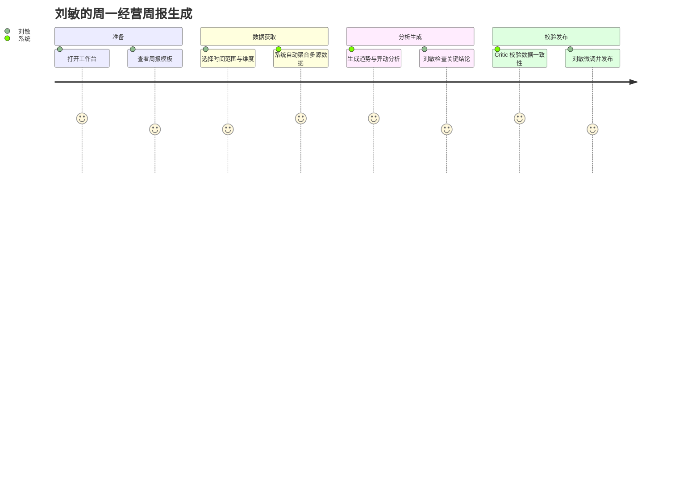
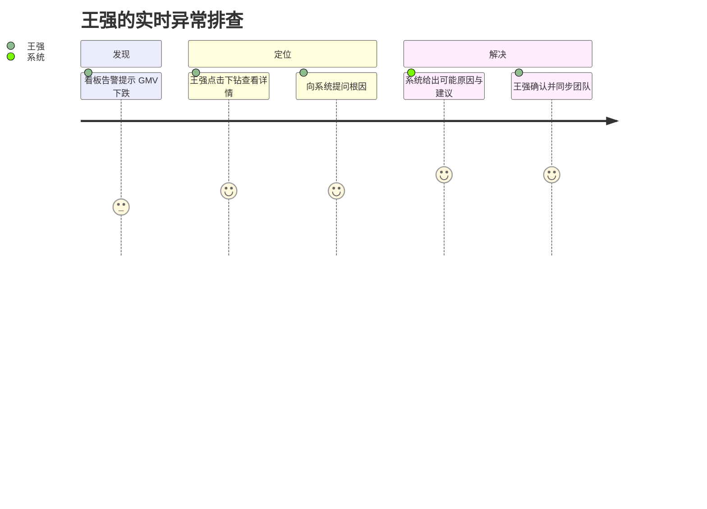
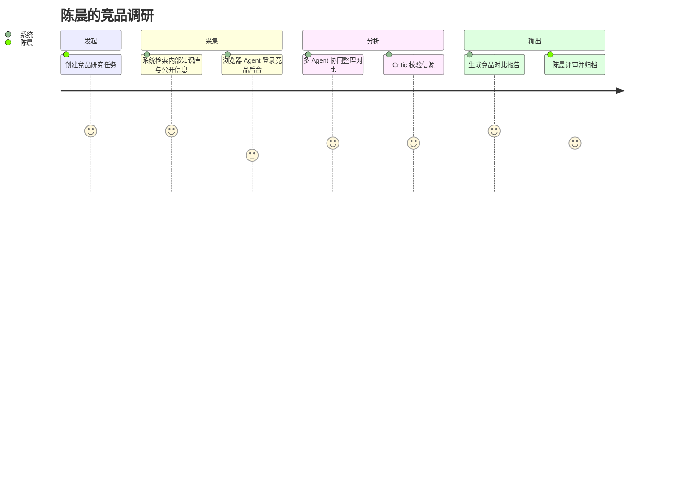
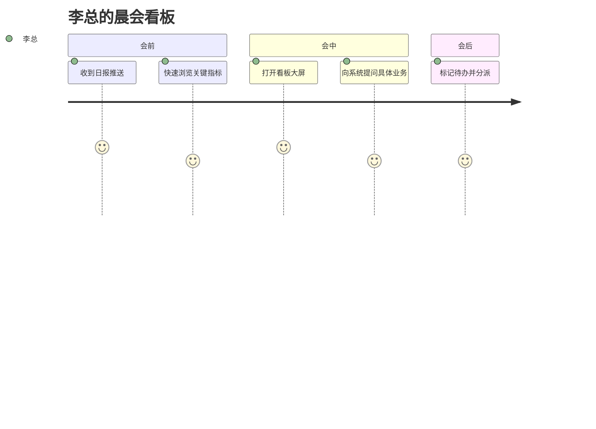
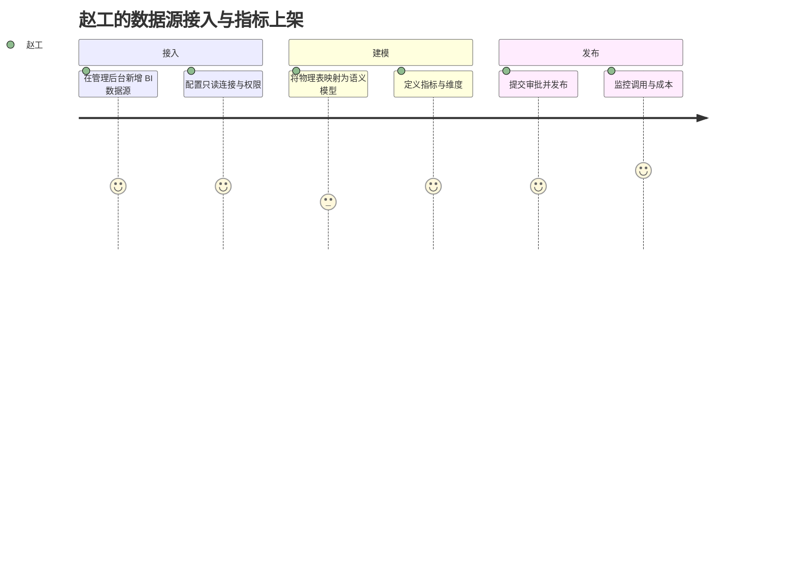

# 归因模块用户旅程设计

## 1. 目标用户画像

### 1.1 业务分析师：刘敏

| 维度 | 描述 |
|------|------|
| 角色 | 商业分析部高级分析师 |
| 目标 | 高效产出经营分析周报、支持业务决策 |
| 痛点 | 跨系统取数口径不一致、重复劳动多、报告难以追溯 |
| 技术熟练度 | 熟悉 SQL 和 Excel，希望减少手工操作 |
| 高频场景 | 周报生成、指标异动分析、专题研究 |

### 1.2 运营主管：王强

| 维度 | 描述 |
|------|------|
| 角色 | 电商运营主管 |
| 目标 | 实时监控核心指标，快速发现并解决业务异常 |
| 痛点 | 指标分散在多个后台，异常根因定位慢 |
| 技术熟练度 | 偏向业务操作，偏好自然语言交互 |
| 高频场景 | 看板监控、异常追问、日报查看 |

### 1.3 产品经理：陈晨

| 维度 | 描述 |
|------|------|
| 角色 | B 端产品负责人 |
| 目标 | 掌握竞品动态和用户反馈，指导产品规划 |
| 痛点 | 竞品信息散落在公开渠道，整理耗时且主观性强 |
| 技术熟练度 | 能写简单查询，重视结论可信度 |
| 高频场景 | 竞品监控、用户洞察、需求优先级分析 |

### 1.4 管理层：李总

| 维度 | 描述 |
|------|------|
| 角色 | 事业部总经理 |
| 目标 | 在有限时间内掌握经营全貌，做出决策 |
| 痛点 | 信息过载，难以快速抓住关键结论 |
| 技术熟练度 | 非技术背景，依赖可视化摘要 |
| 高频场景 | 晨会看板、日报阅读、经营报告审批 |

### 1.5 数据工程师：赵工

| 维度 | 描述 |
|------|------|
| 角色 | 数据平台工程师 |
| 目标 | 稳定、安全地接入数据源，维护指标口径 |
| 痛点 | 重复对接各类业务系统，指标变更难以管理 |
| 技术熟练度 | 精通数据库和 ETL，关注可观测性 |
| 高频场景 | 数据源接入、指标建模、权限配置 |

---

## 2. 核心用户旅程地图

### 2.1 旅程一：刘敏的周一经营周报生成

| 阶段 | 用户行为 | 触点 | 用户想法 | 情绪 | 痛点 | 机会点 |
|------|----------|------|----------|------|------|--------|
| 准备 | 登录系统，进入工作台，查看"经营周报"快捷入口 | 工作台、模板库 | "上周的数据应该已经准备好了" | 平静 | 入口不统一 | 基于用户角色智能推荐常用模板 |
| 配置 | 选择时间范围（上周）、维度（按部门/渠道）、关键指标 | 报告配置页 | "希望口径和上个月一致" | 谨慎 | 担心口径变化 | 自动继承上期配置，高亮变更项 |
| 执行 | 系统调用数据分析 Worker，聚合 BI、CRM、财务数据 | 进度条、任务状态 | "这次不用手动导表了" | 期待 | 等待时间长 | 异步执行，支持中断恢复 |
| 分析 | 系统生成趋势图、异动标注、关键结论 | 报告编辑页 | "结论看起来合理，但需要核对" | 积极 | 结论不够细化 | 支持下钻到原始数据和查询语句 |
| 校验 | Critic 自动校验数据一致性和口径 | 校验面板 | "有校验机制更放心" | 信任 | 误报较多 | 允许用户标记误报，持续优化 |
| 发布 | 刘敏微调结论，导出 PDF，分享给管理层 | 报告详情页 | "可以发周报给李总了" | 满意 | 格式调整繁琐 | 提供企业模板和一键分发 |

### 2.2 旅程二：王强的实时异常排查

| 阶段 | 用户行为 | 触点 | 用户想法 | 情绪 | 痛点 | 机会点 |
|------|----------|------|----------|------|------|--------|
| 发现 | 收到看板阈值告警，GMV 同比下跌 15% | 看板、IM 推送 | "又有异常了，得赶紧看" | 焦虑 | 告警噪音多 | 智能降噪，区分真实异常与正常波动 |
| 定位 | 点击指标卡片下钻，查看按渠道/SKU 拆分 | 看板详情页 | "哪个渠道出了问题？" | 紧张 | 下钻路径不直观 | 自然语言提问替代多层下钻 |
| 探查 | 输入"为什么今天 GMV 下降"，系统调用数据分析 Worker | 任务问答页 | "希望系统能直接告诉我原因" | 期待 | 回答泛泛而谈 | 结合多源数据，给出归因排序 |
| 验证 | 查看系统给出的归因假设（流量下降、转化率降低、客单价变化） | 归因分析面板 | "需要确认数据是否准确" | 谨慎 | 缺乏信源说明 | 每个结论附带数据来源和查询语句 |
| 行动 | 根据建议联系投放团队调整预算，并在系统中标记处理结果 | 工单/协作面板 | "问题解决了" | 释然 | 与现有流程割裂 | 打通 IM/待办，形成闭环 |

### 2.3 旅程三：陈晨的竞品调研

| 阶段 | 用户行为 | 触点 | 用户想法 | 情绪 | 痛点 | 机会点 |
|------|----------|------|----------|------|------|--------|
| 发起 | 在研究模块选择"竞品调研"模板，输入目标竞品 | 深度研究页 | "希望一周内拿到完整对比" | 积极 | 模板不够贴合行业 | 按行业预设调研框架 |
| 采集 | 系统通过 Web 抓取、MCP 服务、浏览器 Agent 收集信息 | 采集进度页 | "别漏掉关键信息" | 期待 | 部分站点访问受限 | 沙箱浏览器 + 凭证托管，合规采集 |
| 整理 | 深度研究 Worker 抽取价格、功能、用户评价等维度 | 素材库 | "信息太杂，需要结构化" | 中性 | 信息噪声大 | 自动去重、聚类、可信度评分 |
| 校验 | Critic 校验公开信息的来源和时效性 | 校验面板 | "公开信息不一定准" | 谨慎 | 校验结果不透明 | 展示每条结论的信源和置信度 |
| 输出 | 生成包含对比矩阵和 SWOT 分析的报告 | 报告页 | "可以直接放进 PRD" | 满意 | 报告风格不统一 | 支持自定义报告模板和品牌规范 |

### 2.4 旅程四：李总的晨会看板

| 阶段 | 用户行为 | 触点 | 用户想法 | 情绪 | 痛点 | 机会点 |
|------|----------|------|----------|------|------|--------|
| 会前 | 在手机上收到系统日报推送，查看昨日经营摘要 | 日报邮件/IM | "先看一眼有没有大问题" | 平静 | 信息过多 | 智能摘要，突出需关注项 |
| 会中 | 打开会议室大屏，进入经营看板 | 看板大屏 | "今天要重点看转化率" | 专注 | 切换指标慢 | 语音/自然语言快捷切换 |
| 提问 | 询问"华东区本月转化率为什么低于华北" | 语音/问答浮层 | "希望一句话就能出结果" | 期待 | 语音识别不准 | 支持文本 fallback |
| 决策 | 根据系统给出的归因，决定增加华东促销资源 | 决策记录 | "结论可信吗？" | 谨慎 | 缺乏决策依据追溯 | 自动记录决策依据和数据快照 |
| 会后 | 在系统中标记待办，指派给运营负责人 | 协作面板 | "会后跟进要有记录" | 满意 | 与 OA 系统不连通 | 对接企业待办/审批系统 |

### 2.5 旅程五：赵工的数据源接入与指标上架

| 阶段 | 用户行为 | 触点 | 用户想法 | 情绪 | 痛点 | 机会点 |
|------|----------|------|----------|------|------|--------|
| 接入 | 在管理后台选择"新增数据源"，填写 BI 连接信息 | 数据源管理页 | "每次接入都要配很多参数" | 中性 | 配置复杂 | 提供连接模板和自动检测 |
| 权限 | 配置只读账号、查询超时、结果集限制 | 权限配置页 | "安全不能出问题" | 谨慎 | 权限配置分散 | 统一权限模板，按部门快速授权 |
| 建模 | 选择物理表，映射为语义模型，定义指标公式 | 语义建模页 | "希望业务能看懂这些字段" | 专注 | 字段太多难以管理 | 基于 AI 自动推荐字段语义 |
| 上架 | 提交指标审核，发布后通知相关用户 | 审批流 | "上新指标要走流程" | 中性 | 审批周期长 | 低风险指标自动审批 |
| 运维 | 查看数据源调用量、慢查询、成本占用 | 可观测面板 | "成本要可控" | 关注 | 缺乏成本视角 | FinOps 面板，按工作区分摊 |

---

## 3. 跨旅程通用体验要素

### 3.1 情绪曲线总览

| 阶段 | 整体情绪 | 主要驱动因素 |
|------|----------|--------------|
| 登录/准备 | 平静 → 积极 | 工作台个性化推荐 |
| 配置/发起 | 谨慎 → 期待 | 继承历史配置、模板引导 |
| 等待执行 | 期待 → 焦虑 | 进度透明、支持取消/恢复 |
| 查看结果 | 谨慎 → 满意 | 结论可信、可追溯 |
| 协作/发布 | 满意 → 信任 | 审批与审计闭环 |

### 3.2 关键触点矩阵

| 触点 | 覆盖用户 | 承载功能 | 优化方向 |
|------|----------|----------|----------|
| 工作台 | 全量 | 快捷入口、待办、最近动态 | 按角色智能排序 |
| 任务问答 | 分析师、运营、管理层 | 自然语言查询、流式回答 | 意图识别准确性 |
| 洞察报告 | 分析师、管理层 | 报告生成、编辑、发布 | 模板丰富度与可信度 |
| 看板 | 运营、管理层 | 实时监控、下钻、告警 | 响应速度与告警质量 |
| 日报 | 管理层、团队负责人 | 定时摘要、推送 | 摘要准确性与可读性 |
| 管理后台 | 数据工程师、管理员 | 数据源、指标、权限、审计 | 配置效率与可观测性 |

### 3.3 痛点与机会点汇总

| 痛点 | 影响用户 | 对应机会点 | 优先级 |
|------|----------|------------|--------|
| 跨系统取数口径不一致 | 分析师 | 统一语义层 + 指标字典 | 高 |
| 异常定位路径长 | 运营 | 自然语言归因 + 一键下钻 | 高 |
| 竞品信息分散 | 产品经理 | 多 Agent 自动采集与校验 | 高 |
| 决策依据难以追溯 | 管理层 | 数据快照 + 决策记录 | 中 |
| 数据源接入成本高 | 数据工程师 | 连接模板 + 自动 schema 推荐 | 中 |
| 模型输出可信度不确定 | 全量 | Critic 校验 + 信源展示 | 高 |
| 成本缺乏管控 | 管理员 | FinOps 面板 + 预算告警 | 中 |

---

## 4. 场景用例（Use Cases）

### UC01：自然语言查询经营指标

- **参与者**：业务分析师、运营
- **前置条件**：用户已登录，拥有相关指标读取权限
- **主流程**：
  1. 用户在任务问答输入自然语言问题
  2. 系统解析意图并推荐相关指标
  3. 用户确认后系统生成 SemanticQuery
  4. 系统调用聚合引擎返回结果
  5. 系统生成可视化与结论，流式展示给用户
- **后置条件**：问答记录保存，用户可收藏或追问
- **异常处理**：指标权限不足时提示申请；查询超时时转为异步任务

### UC02：生成经营分析报告

- **参与者**：业务分析师、管理层
- **前置条件**：用户已登录，拥有报告模板和数据源权限
- **主流程**：
  1. 用户选择报告模板并配置参数
  2. 系统拆解为数据查询和研究任务
  3. 多 Agent 协同执行
  4. Critic 校验结果一致性
  5. 生成可编辑报告，用户审阅后发布
- **后置条件**：报告进入版本管理，可订阅和分发
- **异常处理**：数据缺失时标记并建议补充数据源

### UC03：实时监控与异常告警

- **参与者**：运营主管、管理层
- **前置条件**：看板已配置，告警规则已启用
- **主流程**：
  1. 系统按规则检测指标异常
  2. 触发告警并推送至 IM/邮件
  3. 用户点击告警进入看板下钻
  4. 用户通过自然语言追问根因
  5. 系统给出归因建议
- **后置条件**：用户标记处理结果，形成闭环
- **异常处理**：告警误报支持用户反馈，优化规则

### UC04：竞品深度研究

- **参与者**：产品经理、市场研究人员
- **前置条件**：用户已登录，研究模板可用
- **主流程**：
  1. 用户输入竞品名称和研究维度
  2. 系统通过 Web 抓取、MCP、浏览器 Agent 采集信息
  3. 深度研究 Worker 整理对比内容
  4. Critic 校验信源和时效
  5. 生成结构化研究报告
- **后置条件**：报告归档至知识库，支持后续引用
- **异常处理**：站点访问失败时记录并尝试备用源

### UC05：数据源接入与指标上架

- **参与者**：数据工程师、平台管理员
- **前置条件**：用户拥有数据源管理权限
- **主流程**：
  1. 用户在管理后台创建数据源
  2. 配置连接、权限、查询限制
  3. 将物理表映射为语义模型
  4. 定义指标、维度、血缘
  5. 提交审批并发布
- **后置条件**：业务用户可在问答和报告中使用该指标
- **异常处理**：连接失败时给出诊断建议；审批驳回时说明原因

---

## 5. 体验度量指标

| 指标 | 定义 | 目标值 |
|------|------|--------|
| 问答意图识别准确率 | 系统正确理解用户问题的比例 | ≥ 85% |
| 首屏响应时间 | 简单问答首次返回内容的时间 | ≤ 2s |
| 报告生成成功率 | 复杂报告成功完成的比例 | ≥ 95% |
| 用户收藏率 | 问答/报告被收藏的比例 | ≥ 20% |
| 告警准确率 | 真实异常占触发告警的比例 | ≥ 80% |
| 数据源接入周期 | 从申请到上线可用的时间 | ≤ 3 个工作日 |
| 用户 NPS | 用户净推荐值 | ≥ 30 |
